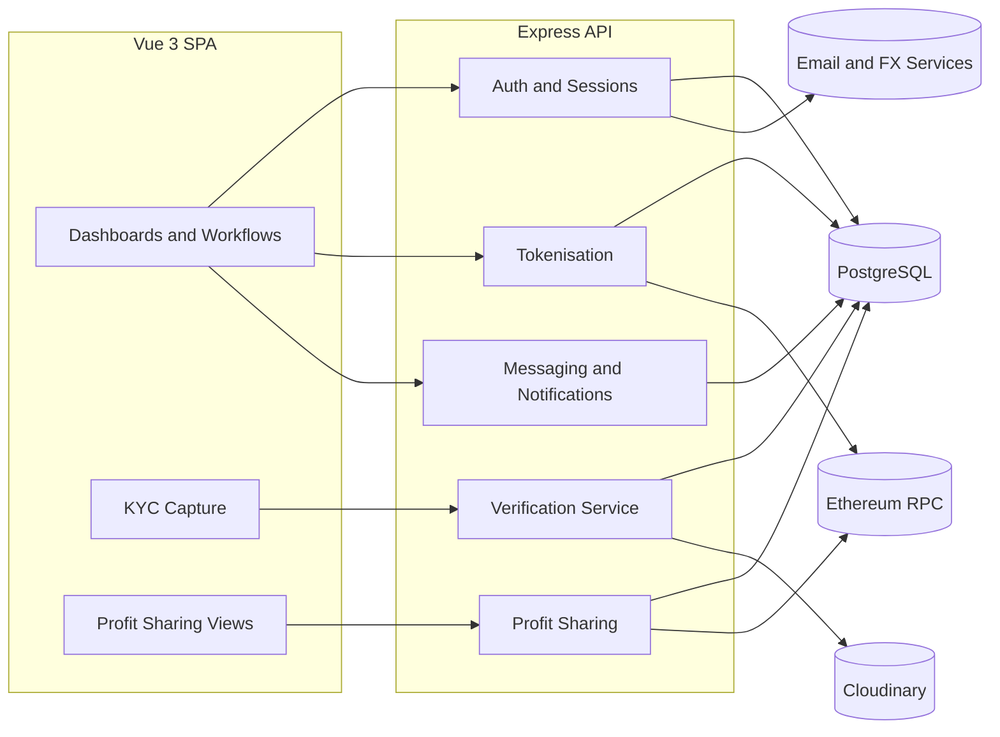
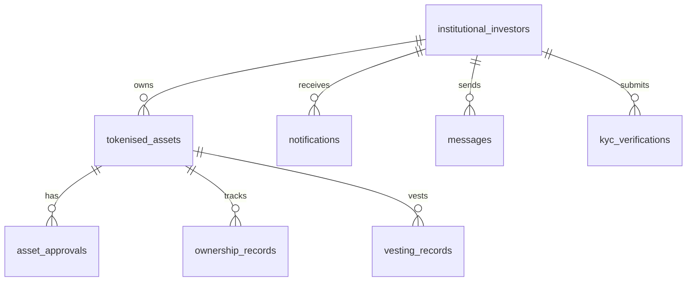
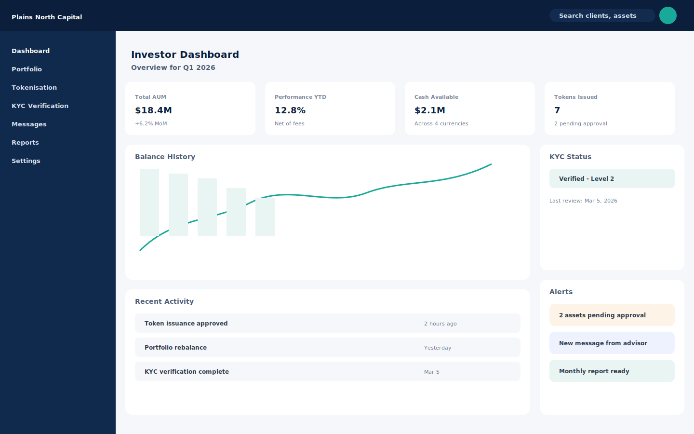
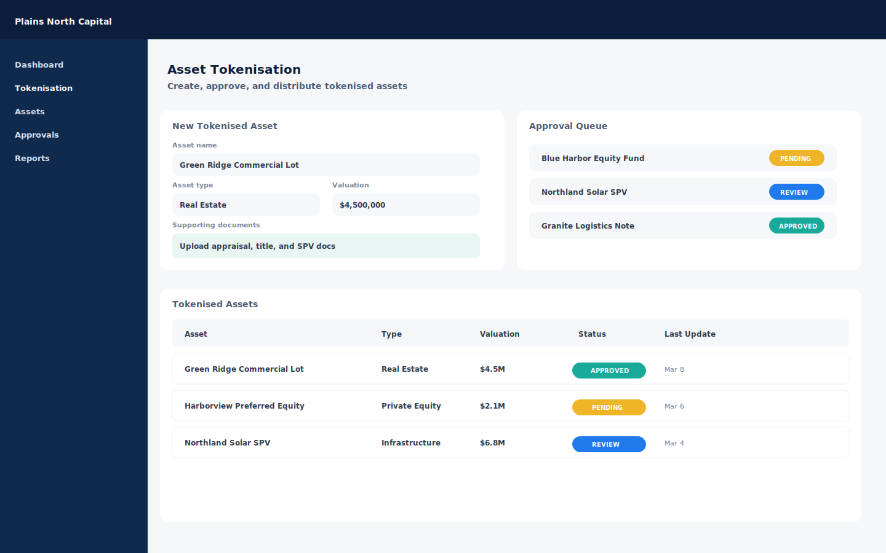
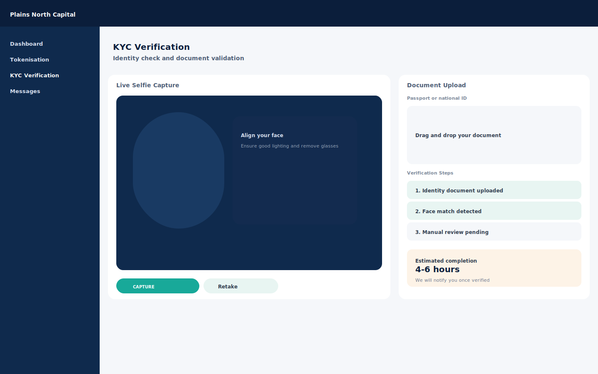
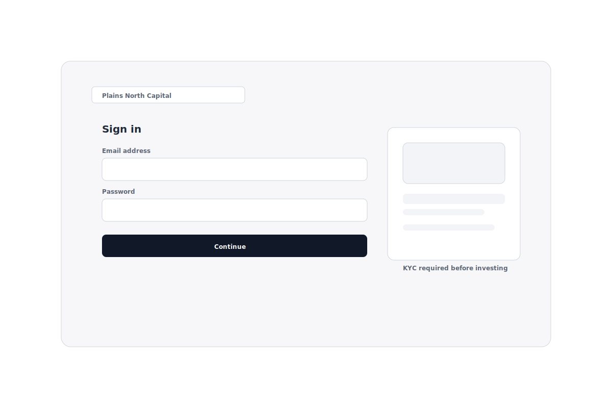
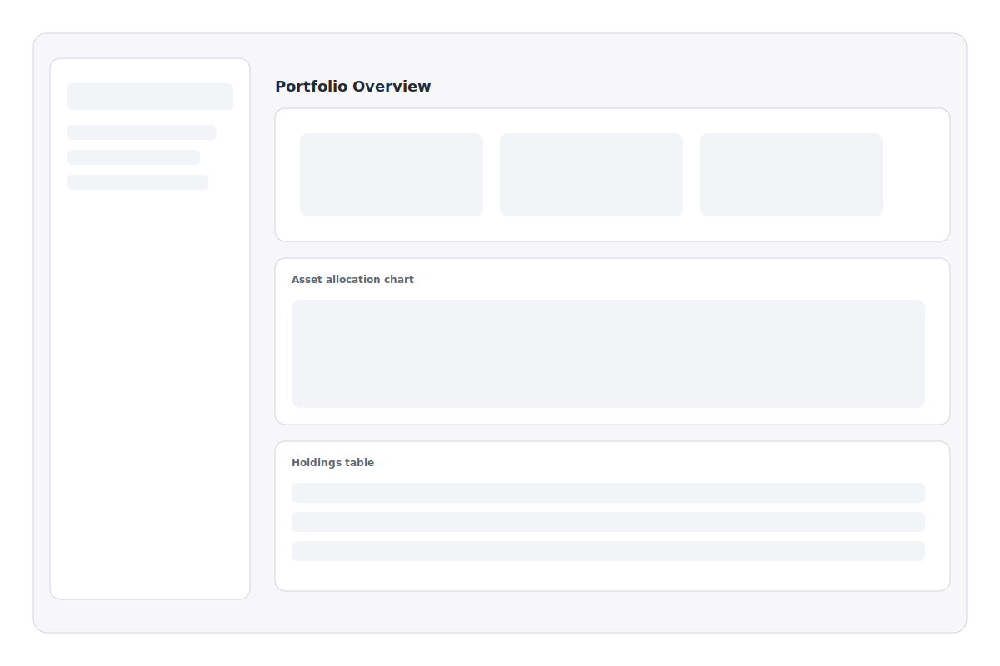
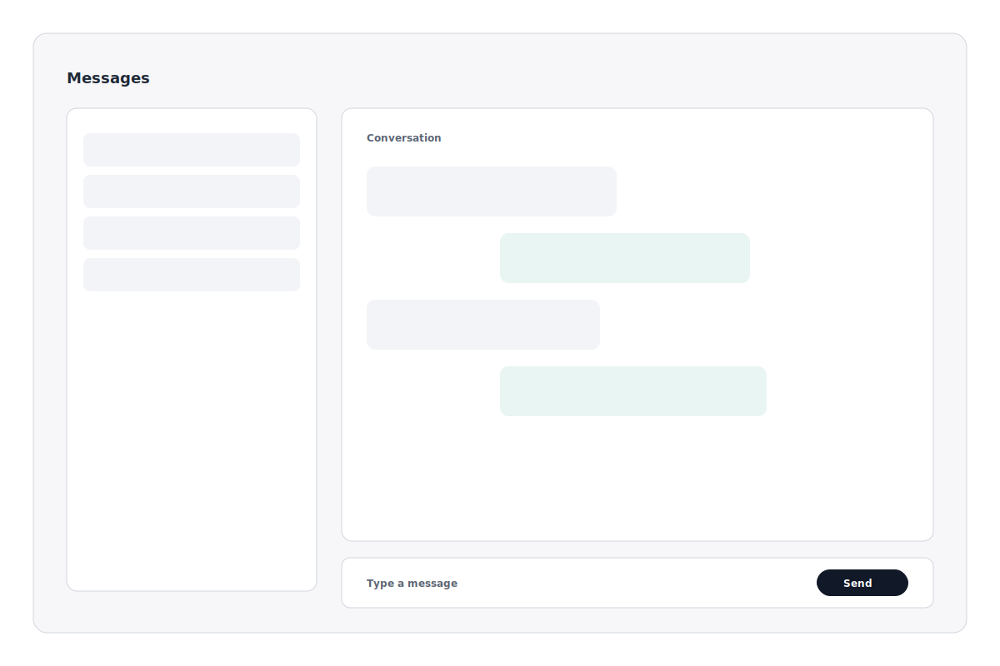

# Investor App Platform - Case Study

## Executive summary
The Investor App Platform is a full-stack investment management system that blends traditional advisory workflows with digital asset tokenization. The platform supports role-based experiences for managers and clients, integrated KYC verification, asset tokenization with on-chain audit trails, and profit-sharing dashboards. It is implemented as a Vue 3 single-page application backed by an Express/Node API and a PostgreSQL database.

This case study documents the product goals, architecture, core workflows, and current delivery status, and includes conceptual UI screenshots and wireframe mockups to support presentations or stakeholder reviews.

## Project snapshot
- Product: Investor App Platform
- Primary users: Managers, Clients, Admin
- Core domains: Authentication, KYC, Tokenization, Profit Sharing, Messaging, Notifications, Reporting
- Stack: Vue 3 + Vite + Pinia (frontend), Node/Express + Sequelize + PostgreSQL (backend)
- Integrations: Cloudinary for media, blockchain signing/metadata for tokenized assets

## Problem statement
Investment firms managing both traditional and tokenized assets need a single, auditable workspace where teams can onboard clients, validate identity, tokenize assets, and monitor distributions. Many organizations rely on disconnected tools that create delays, compliance risk, and inconsistent reporting.

## Goals and success criteria
- Provide a unified workspace for clients and managers
- Ensure compliance with KYC and audit trails for tokenized assets
- Support high-touch client communications and status visibility
- Enable reporting for performance, distributions, and operational metrics
- Deliver a scalable architecture with clear separation of concerns

## Users and roles
- Client: reviews portfolio, submits KYC, views tokenized assets, receives notifications
- Manager: onboards clients, reviews KYC, creates and approves tokenized assets
- Admin: oversees compliance, distributions, and operational dashboards

## Solution overview
The platform is structured around modular domains that map directly to the investment lifecycle:

1. Authentication and profile management for secure access and role-based routing
2. KYC verification with live selfie capture, document upload, and OCR
3. Tokenization workflows for creating, reviewing, and approving assets
4. Messaging and notifications for client-manager communication
5. Profit-sharing dashboards for capital recovery and distribution monitoring
6. Reporting and analytics across assets, balances, and historical activity

## Core user journeys
### 1) Client onboarding and verification
- Create account and complete profile
- Upload selfie and government ID
- Automated face match and OCR extraction
- Manual review step for compliance gating

### 2) Asset tokenization
- Manager creates or reviews tokenized asset
- Supporting documents uploaded and stored via Cloudinary
- Asset approval workflow captures on-chain signature breadcrumbs
- Portfolio and reporting views update with asset status

### 3) Profit sharing and distribution
- Admin submits monthly profit results
- Distribution logic supports capital recovery stages
- Dashboards show investor distributions and status

### 4) Communication and follow-ups
- In-app messaging between clients and managers
- Notifications for approvals, KYC status, and reports
- Audit-friendly activity records

## Architecture
The system uses a client-server architecture with strong domain boundaries.

## Data model (simplified)

## Implementation highlights
- Tokenisation uses PostgreSQL tables with on-chain signature breadcrumbs for auditability
- KYC uses live camera capture, face matching, and OCR to validate identities
- Notifications auto-update read status and support action-required flows
- Exchange rate service caches currency data for reporting and multi-currency UX
- Profit sharing subsystem tracks capital recovery and distributions over time

## Security and compliance
- JWT-based authentication with session extension flows
- Role-based access control across routes and UI
- Rate limiting, CORS, and security headers applied at the API layer
- Sanitization and validation on file uploads and data inputs

## Current delivery status (as of repository state)
### Implemented
- Auth, profile, and role-based routing
- Tokenization CRUD and approval workflows
- KYC upload and verification pipeline
- Messaging and notifications
- Profit-sharing dashboards and APIs

### In progress / partial
- Vesting routes require consolidation with the service layer
- Subscription and billing flows require alignment with the frontend and Stripe wiring
- Real-time updates currently use polling; WebSocket hooks are present but not active

### Planned
- API documentation and OpenAPI spec
- Expanded analytics and automated reporting
- Dedicated background worker for blockchain event ingestion

## Risks and open gaps
- WebSockets not fully implemented (polling is the current fallback)
- Subscription API mismatch between frontend and backend
- Vesting route code includes legacy schema assumptions
- Some charts still use demo data when full history is not available

## Outcomes and metrics (recommended)
To capture impact post-launch, measure:
- KYC completion rate and time-to-verify
- Tokenisation approval cycle time
- Client engagement (messages, logins, report downloads)
- Distribution accuracy and auditability
- Support ticket volume before/after adoption

## Visuals
### Conceptual screenshots
- Investor dashboard: `./assets/screenshots/dashboard-investor.svg`
- Asset tokenisation: `./assets/screenshots/asset-tokenization.svg`
- KYC verification: `./assets/screenshots/kyc-verification.svg`

### Wireframe mockups
- Login flow: `./assets/mockups/login-wireframe.svg`
- Portfolio overview: `./assets/mockups/portfolio-wireframe.svg`
- Messaging experience: `./assets/mockups/messages-wireframe.svg`

## Appendix: image gallery

