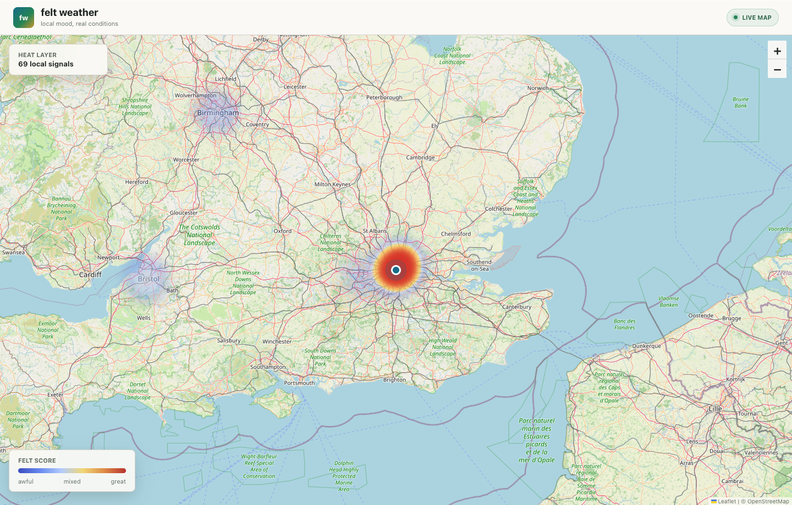
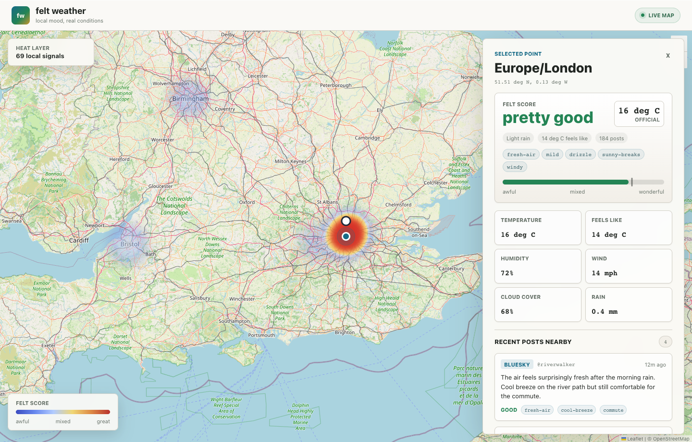
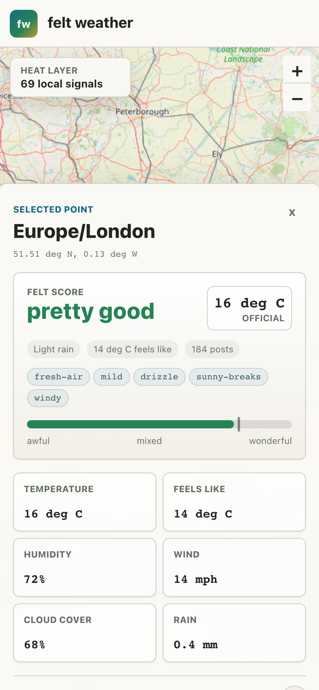

# Felt Weather Case Study

**Live app:** [https://felt.flat18.app](https://felt.flat18.app)

## Turning Forecasts Into Local Weather Intelligence

Felt Weather helps people understand what the weather is actually like in a place, not only what an official forecast says it should be. The app combines live meteorological conditions with nearby public social posts, classifies those posts for weather sentiment, and presents the result as a map-based "felt score" that shows where conditions feel awful, mixed, decent, or great.

Most weather products answer a narrow question: temperature, wind, humidity, cloud cover, and precipitation. Felt Weather answers the follow-up question that users make decisions from: _Will it feel comfortable where I am going?_

The result is a practical, local weather layer for commuters, event teams, hospitality operators, local publishers, travel planners, and anyone whose plans depend on street-level conditions.



_Sample populated UI: live map with representative demo signals._

## The Challenge

Weather data is accurate, but it is often too abstract for real-world planning. Two locations can share the same temperature and rain reading while feeling completely different because of wind exposure, shade, humidity, crowd density, transit delays, local drizzle, or short sunny breaks.

Traditional weather apps also miss fast-moving human context:

- A drizzle reading does not explain whether people nearby are still happy to walk, queue, dine outside, or commute.
- A comfortable temperature can still feel unpleasant if wind is funneled through open streets.
- A forecast can lag behind microclimates, brief showers, or changing local conditions.
- Local businesses and venues need to know how the weather feels to people right now, not only what a regional station reports.

Felt Weather closes that gap by pairing official weather with recent human observations from the surrounding area.

## The Solution

Felt Weather adds a "felt layer" on top of official weather. It ingests local posts from public social sources, classifies weather-related language into sentiment and comfort signals, and aggregates those signals by geography.

The frontend turns those signals into an interactive heatmap:

- Blue and muted areas indicate poor or mixed local feeling.
- Yellow, orange, and red areas show stronger positive or high-intensity felt conditions.
- A selected point opens a location panel with official conditions, the aggregated felt score, weather tags, and recent nearby posts.
- The same workflow adapts to mobile, where the detail panel becomes a bottom sheet for quick field use.



_Sample populated UI: selected location with official conditions, aggregate sentiment, and nearby post evidence._

## Product Usefulness

Felt Weather is useful because it turns noisy local chatter into a structured decision layer.

For everyday users, it helps answer practical questions before they leave:

- Is the rain light enough to walk through?
- Does it feel colder than the temperature suggests?
- Are people nearby describing the weather as pleasant, miserable, windy, humid, or disruptive?
- Is a nearby area feeling better or worse than where I am?

For operators and businesses, it helps convert local weather perception into action:

- Restaurants and cafes can judge whether outdoor seating still feels viable.
- Event teams can monitor whether conditions are becoming uncomfortable around a venue.
- Tourism and hospitality teams can recommend nearby areas with better perceived conditions.
- Transit and mobility teams can understand where weather sentiment may affect rider behavior.
- Local media can surface human-centered weather stories without manually scanning social feeds.

The app does not replace official forecasts. It makes them more actionable by adding human context.

## Key Features

### Live Felt-Score Heatmap

The main map shows aggregated local weather sentiment as a heat layer. It updates based on the visible map bounds and zoom level, giving users a scannable view of how conditions feel across a region.

The heatmap API returns bounded signal clusters with intensity, comfort, and count data. At closer zoom levels, the system uses smaller grid precision and fresher data windows, making local exploration more granular.

### Local Drill-Down Panel

Clicking any point opens a location panel with:

- Official Open-Meteo weather for the selected coordinate.
- Temperature and apparent temperature.
- Humidity, wind speed, cloud cover, and rainfall.
- Aggregated felt score from nearby classified posts.
- Top local descriptors such as `fresh-air`, `mild`, `drizzle`, `windy`, or `sunny-breaks`.
- Recent nearby posts that explain the score in plain language.

This turns the map from a broad signal into evidence users can inspect.

### Official Weather Plus Human Signal

The felt score is intentionally shown next to official weather. A user can see both the measured conditions and the lived response:

- Official temperature may say 16 deg C.
- Apparent temperature may feel closer to 14 deg C.
- Social signal may still be positive because people nearby describe fresh air, mild conditions, or sunny breaks.

That comparison is the product's core value: it shows when lived experience agrees with, softens, or contradicts the forecast.

### Nearby Post Feed

The post feed gives the score credibility. Users can see recent weather-related comments, their source, relative time, sentiment label, and tags.

Instead of asking people to trust a black-box score, Felt Weather exposes the supporting local evidence in a compact, readable format.

### Mobile-Ready Local Workflow

On mobile, the map remains the entry point, and the selected-location panel slides up from the bottom. This keeps the workflow usable for people making decisions while already outside, commuting, or moving between places.



_Sample populated UI: responsive mobile location workflow._

## How It Works

Felt Weather is built as a lightweight, serverless weather intelligence pipeline.

1. Ingest workers collect public local weather conversation from Bluesky, Mastodon, and Reddit, alongside weather baseline data.
2. Posts are stored with source, content, author handle, raw location, coordinates, and posting time.
3. A classifier worker processes queued posts. It first uses learned keyword patterns for fast, explainable classification.
4. If keyword confidence is too low, the classifier can use a Cloudflare AI model to extract a sentiment score, comfort index, weather tags, and key phrases.
5. New phrases discovered by the model are saved back into the keyword pattern table, improving future classification.
6. Sentiment readings are stored by coordinate and time, with indexes optimized for geospatial lookup.
7. The API worker serves heatmap points, selected-location weather, and nearby classified posts.
8. The Vue frontend renders the Leaflet map, heat layer, detail panel, sentiment meter, weather details, and post feed.

The architecture is intentionally practical:

- **Frontend:** Vue, Pinia, Vue Router, Leaflet, Leaflet Heat.
- **API:** Cloudflare Worker routes for heatmap, location, posts, and geolocation.
- **Ingest:** Cloudflare Worker scheduled jobs and manual trigger support.
- **Classification:** Cloudflare Queue worker with keyword-first classification and optional LLM fallback.
- **Database:** CockroachDB tables for posts, sentiment readings, keyword patterns, and weather cache.
- **Weather:** Open-Meteo current conditions, cached by rounded coordinate.

## Why This Matters

Weather affects movement, mood, spend, staffing, travel, and attendance. But weather decisions are often made with incomplete context. Felt Weather makes that context visible.

The app is especially valuable when:

- Conditions are changing quickly.
- Official readings are technically correct but do not match street-level comfort.
- A city has microclimates across neighborhoods.
- Local sentiment matters as much as meteorological precision.
- Teams need a visual operational layer instead of raw weather feeds.

By organizing public observations into a spatial sentiment layer, Felt Weather creates a new category between weather data and social listening: local weather experience intelligence.

## Example Marketing Positioning

### Headline

Weather, as people actually feel it.

### Supporting Copy

Felt Weather combines official conditions with nearby public weather conversation to reveal how comfortable, disruptive, or pleasant the weather feels on the ground. Explore a live map, inspect local felt scores, and understand the human context behind the forecast.

### Feature Blocks

**See the local mood of the weather**  
An interactive heatmap shows where conditions feel good, mixed, or uncomfortable based on recent local signals.

**Compare official data with lived experience**  
Temperature, apparent temperature, humidity, wind, cloud cover, and rain sit beside a human-centered felt score.

**Inspect the evidence behind every score**  
Nearby posts and weather tags explain why an area is trending pleasant, windy, damp, humid, fresh, or miserable.

**Designed for decisions in motion**  
The responsive map and mobile panel help users make quick location-based calls while commuting, travelling, or operating on-site.

## Website Case Study Summary

Felt Weather is live at [felt.flat18.app](https://felt.flat18.app). It demonstrates how a modern weather product can become more useful by treating local human experience as a first-class signal. The app takes familiar weather inputs, enriches them with classified social observations, and presents the result through a fast, visual interface that supports both everyday decisions and operational planning.

The value is not only that users can see the weather. It is that they can understand what the weather means for people nearby, right now.

## Screenshot Notes

The screenshots in this directory were captured from the real Felt Weather frontend with representative demo API responses. They are populated samples for marketing use and should be treated as product UI examples rather than production analytics from [felt.flat18.app](https://felt.flat18.app).

To regenerate them against the live app shell:

```bash
npm exec --yes --package=playwright -- sh -lc 'NODE_PATH=$(dirname $(dirname $(which playwright))) node case-study/scripts/capture-screenshots.mjs'
```

To regenerate them against a local development server instead, set `FELT_WEATHER_APP_URL`, for example:

```bash
FELT_WEATHER_APP_URL=http://127.0.0.1:5174/ \
npm exec --yes --package=playwright -- sh -lc 'NODE_PATH=$(dirname $(dirname $(which playwright))) node case-study/scripts/capture-screenshots.mjs'
```
