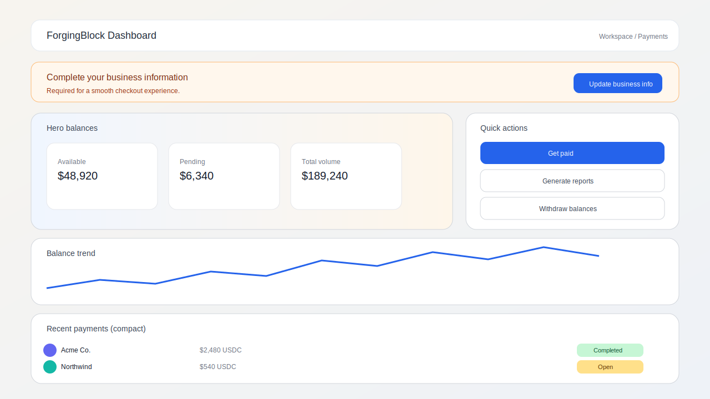
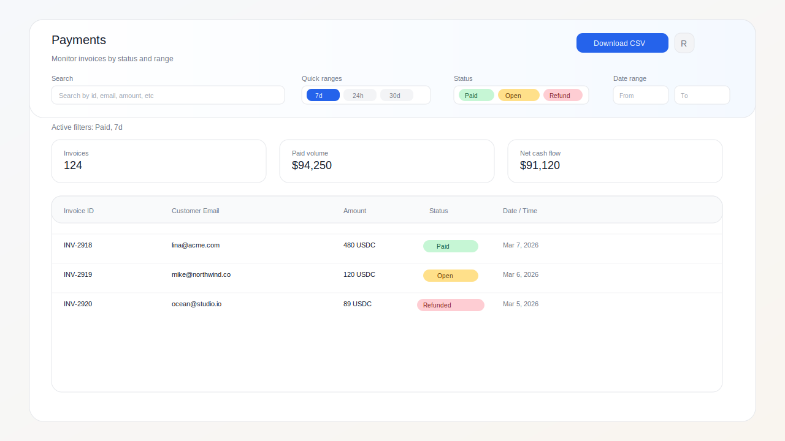
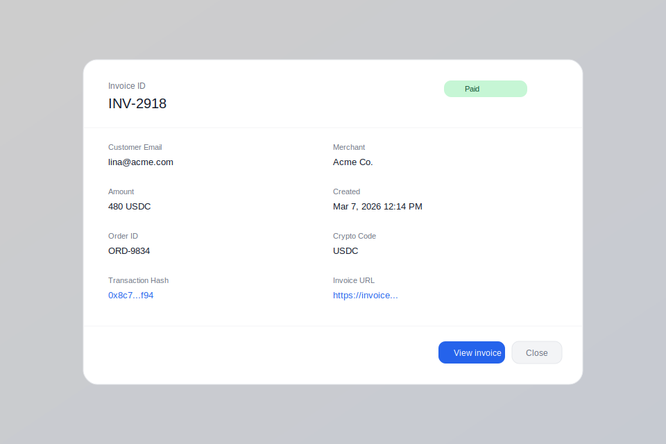
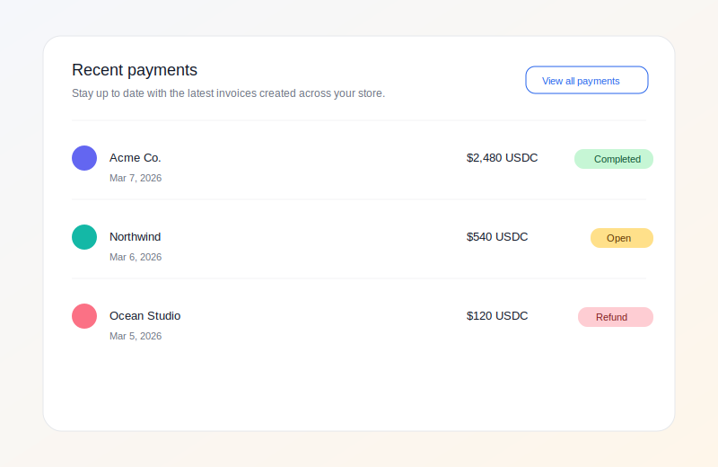
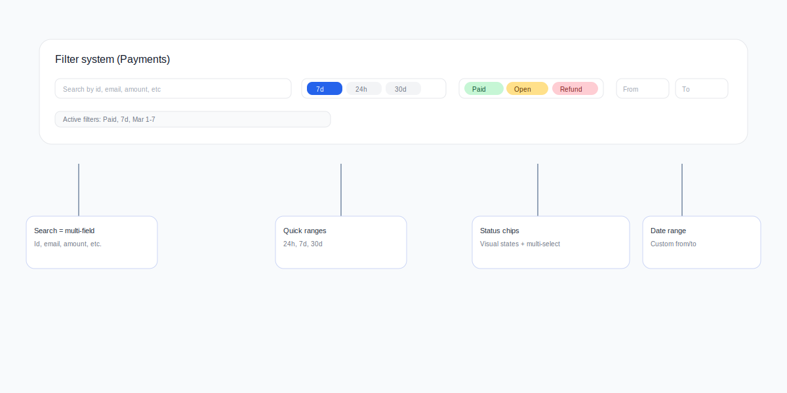
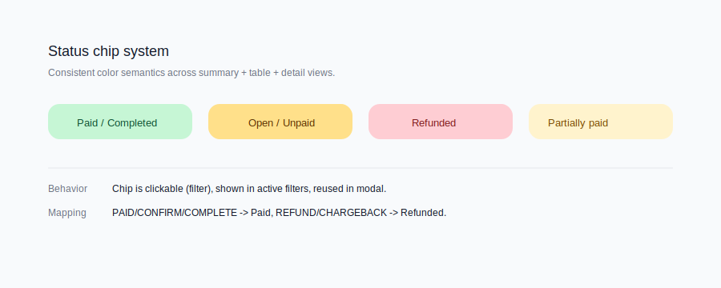
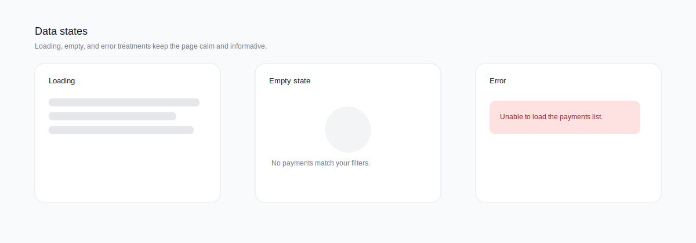
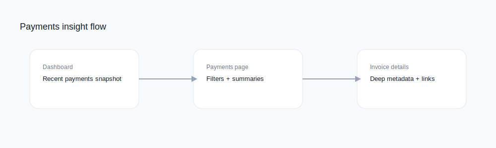

# ForgingBlock Dashboard - Payments Experience Case Study

Date: March 10, 2026

## Executive summary
The ForgingBlock dashboard streamlines how merchants monitor invoices and cash flow. The payments experience is designed around a two-step workflow: quick situational awareness on the dashboard and deep analysis in the Payments page, with a details modal for per-invoice inspection. The UI emphasizes clarity, fast filtering, and trustworthy data states while keeping actions (CSV export, refresh, withdraw) one click away.

## Product context
ForgingBlock is a merchant dashboard for managing invoice-based payments and payouts. The payments surface is composed of:
- Dashboard snapshot: compact list for recent activity and status chips.
- Payments hub: full filter system, summary metrics, and sortable data table.
- Invoice details: a modal grid for deep metadata with copyable fields and links.

## Goals
- Help merchants answer: "What got paid?", "What is still open?", and "What changed today?"
- Reduce time to insight with quick ranges, status chips, and active filter feedback.
- Support export and audit workflows with CSV download and invoice detail links.
- Preserve trust through transparent loading, empty, and error states.

## UX strategy
1. Layered depth: glanceable summary on the dashboard, full analytics on the Payments page.
2. Filter clarity: chips show active filters and can be cleared in-place.
3. Consistent semantics: status colors and labels are reused across cards, table, and modal.
4. Calm system states: skeleton loaders, descriptive errors, and empty state guidance.

## Screenshots (illustrative reconstructions)
These images are recreated from the component structure and styling. They are not runtime captures.

## UI/UX improvements
### 1) Fast filtering with clear feedback
- Unified filters for search, quick ranges, status chips, and custom date range.
- Active filter chips appear below the header and can be removed directly.
- Quick range selection auto-populates date inputs and stays in sync with manual edits.

### 2) Status clarity across the system
- Status mapping groups raw values into Paid, Open, and Refunded categories.
- Colors are consistent in cards, table rows, and the detail view.

### 3) At-a-glance metrics before the table
- Summary tiles show invoice count, paid volume, and net cash flow.
- Metrics update in real time as filters change.

### 4) Data table optimized for scanning
- Compact table layout with fixed headers and sortable columns.
- Amount and currency are paired for easy recognition.
- Status chips provide high-contrast scanning anchors.
- Row click opens an invoice details modal without leaving the page.

### 5) Robust data states
- Skeleton loaders reduce perceived wait time.
- Errors are shown in-line with actionable messaging.
- Empty state explains how to adjust filters.

### 6) Workflow continuity from summary to detail
- Dashboard card surfaces the most recent paid/partially paid invoices.
- Payments page provides full analysis and export.
- Detail modal exposes transaction links and copyable fields for support and reconciliation.

## Feature improvements (implemented)
- CSV export pulls multiple pages, strips watchers, and downloads a clean file.
- Manual refresh re-fetches payments when operators need the newest records.
- Progressive coverage: when filters expand beyond cached data, the list backfills.
- Default status filter avoids empty results; it relaxes if no matching data exists.
- Details modal consolidates invoice links, transaction hashes, and paid amounts.

## Technical highlights
- Payments data is fetched via `dashboard/fetchOrdersRange` and cached with a TTL.
- Filter state is reactive, with watchers syncing preset ranges and custom dates.
- Summary metrics are computed from the filtered list, ensuring accurate rollups.
- UI components separate dashboard summary from the full Payments hub.

## Accessibility and usability notes
- Text sizes follow a readable hierarchy with generous spacing in the header.
- Status chips use color plus label text to avoid color-only reliance.
- Buttons use clear verbs (Download CSV, Refresh, View invoice).

## Measurement plan (recommended)
- Time to first insight: seconds to identify paid vs open invoices.
- Filter engagement: % of sessions using quick ranges or status chips.
- Export success rate: downloads completed without error.
- Support efficiency: time saved per invoice lookup due to the details modal.

## Next opportunities
- Saved filter presets per merchant role.
- Bulk actions (refund, resend invoice) directly from table rows.
- Enhanced audit trail with inline change history in the details modal.

## Appendix: implementation references
- Payments hub UI: `src/components/dashboard/PaymentsCard.vue`
- Dashboard snapshot: `src/components/dashboard/PaymentsCardSimple.vue`
- Payments page wrapper: `src/pages/dashboard/PaymentsPage.vue`
- Dashboard composition: `src/pages/dashboard/DashboardPage.vue`
- Data fetching: `src/store/dashboard/actions.js`
