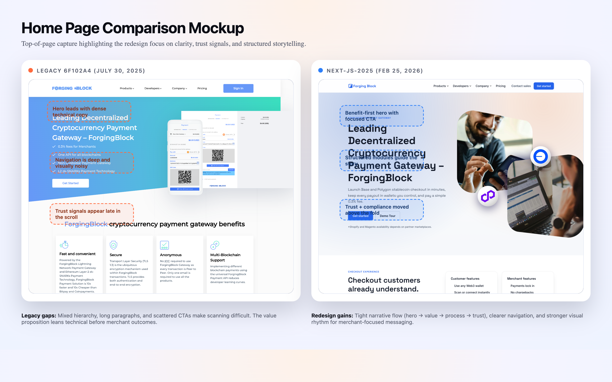
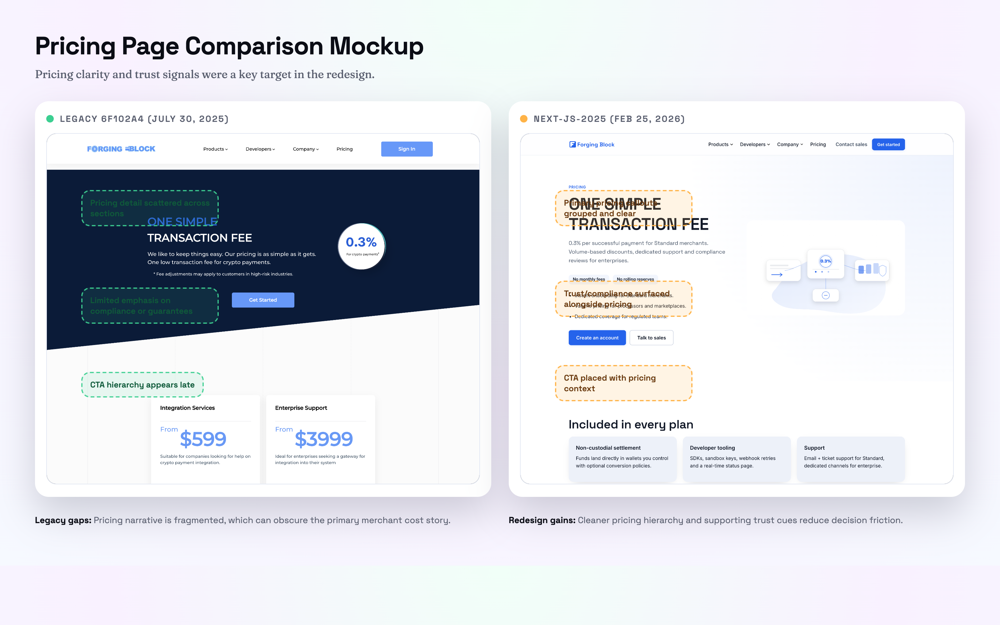

# ForgingBlock Website Redesign Case Study

**Scope:** Marketing website redesign comparing the legacy `master` snapshot (commit `6f102a4`, 2025-07-30) with the `next-js-2025` redesign (commit `b43a3eb`, 2026-02-25).

**Capture date:** 2026-03-10

---

## 1) Executive summary
The legacy site delivered broad feature coverage but missed key website targets: value proposition clarity, trust signaling, mobile scannability, and a consistent narrative flow. The `next-js-2025` redesign reorganizes the experience around a benefit-first hero, structured modules, and a unified design system. The move to a Next.js app also improves maintainability and SEO metadata consistency.

This case study documents the redesign approach, implementation highlights, and a visual before/after comparison using screenshots and mockups.

---

## 2) Project context
- **Legacy site:** Static templates and CSS with deep navigation, dense copy, and heavy iconography. Strengths were coverage and technical credibility, but the experience felt busy and less focused for merchants.
- **Redesign:** A Next.js app router build with modular sections, content-driven marketing pages, and a new visual system.

---

## 3) Website targets (and where legacy missed)
**Targets**
1) Value proposition clarity (merchant outcomes first)
2) Trust signals above the fold
3) Cohesive visual system and hierarchy
4) Mobile-first scannability
5) Accessibility baselines (WCAG 2.1 AA intent)
6) SEO metadata and structured content
7) Maintainable content architecture

**Legacy gaps**
- Benefit-first messaging was diluted by early technical detail.
- Trust/compliance proof surfaced late in the scroll.
- Navigation was deep and visually noisy.
- Mobile layouts were dense and text-heavy.
- Accessibility elements (focus states, skip links, semantic order) were inconsistent.
- Metadata and structured data were not centrally managed.
- Template changes were repetitive across pages.

---

## 4) Research and audit inputs
The redesign direction was informed by a UI/UX, content, SEO, and accessibility study plus competitive benchmarking (BitPay, Coinbase Commerce, BTCPay Server, CoinGate, NOWPayments, OpenNode, Crypto.com Pay, CoinPayments). Key insights:
- Competitors lead with outcomes, then support with technical credibility.
- Trust signals (logos, compliance, case studies) appear early.
- Clean hierarchy, whitespace, and consistent type scales drive scannability.
- Navigation is grouped by journey (Business / Developers).
- Mobile patterns are simplified and fast.

---

## 5) Design strategy and narrative flow
The redesign follows a guided story:
1) **Hero** with benefit-first messaging and a strong CTA
2) **Checkout + value strip** to establish speed and savings
3) **Process section** to explain onboarding steps
4) **Product + solutions** to bridge features to outcomes
5) **Trust + outcomes** to reinforce credibility
6) **Developers + pricing + compliance** to remove friction
7) **Resources + FAQ + final CTA** to convert remaining questions

---

## 6) Implementation highlights
- **Next.js app router** with unified metadata (`buildPageMetadata`) and Open Graph consistency.
- **MarketingPageRenderer** and content-driven configs for most routes (contact, lightning, FAQ, etc.).
- **Header rework** with clearer icon-driven navigation and mobile parity.
- **ProcessSection** added to explain onboarding and improve narrative clarity.
- **Hero motion** using GPU-accelerated transforms and controlled tilt for visual depth.
- **Design system** anchored in shared tokens, gradients, and card patterns for consistency.
- **Structured data** and SEO-friendly sections for core pages.

---

## 7) Visual comparison (screenshots)
### Home page
- Legacy: `assets/screenshots/legacy-6f102a4/home-desktop.png`
- Redesign: `assets/screenshots/next-js-2025/home-desktop.png`

### Pricing
- Legacy: `assets/screenshots/legacy-6f102a4/pricing-desktop.png`
- Redesign: `assets/screenshots/next-js-2025/pricing-desktop.png`

### White-label
- Legacy: `assets/screenshots/legacy-6f102a4/white-label-desktop.png`
- Redesign: `assets/screenshots/next-js-2025/white-label-desktop.png`

### Contact
- Legacy: `assets/screenshots/legacy-6f102a4/contact-desktop.png`
- Redesign: `assets/screenshots/next-js-2025/contact-desktop.png`

### Mobile (home)
- Legacy: `assets/screenshots/legacy-6f102a4/home-mobile.png`
- Redesign: `assets/screenshots/next-js-2025/home-mobile.png`

---

## 8) Mockups (annotated comparisons)
- Home comparison mockup: `assets/mockups/home-comparison.png`
- Pricing comparison mockup: `assets/mockups/pricing-comparison.png`

Source HTML for the mockups:
- `assets/mockups/home-comparison.html`
- `assets/mockups/pricing-comparison.html`

---

## 9) Accessibility and SEO notes
Improvements in the redesign include:
- Centralized metadata for consistent titles/OG tags.
- Structured content blocks for better heading order and scanning.
- Cleaner CTA hierarchy and focus-driven navigation.

Known follow-ups (from the design journal):
- Reintroduce a skip link or quick-nav affordance for keyboard users.
- Audit motion for prefers-reduced-motion compliance.
- Add stronger coverage for accessibility regressions as the layout evolves.

---

## 10) Outcomes (qualitative)
The redesign is expected to improve:
- **Clarity:** Faster understanding of merchant value.
- **Trust:** Earlier and more visible proof points.
- **Conversion:** Clearer CTA placement and pricing narrative.
- **Maintainability:** Modular components and content-driven pages.

---

## 11) Appendix
- Screenshot metadata: `assets/data/snapshot-meta.json`
- Redesign branch: `next-js-2025` (commit `b43a3eb`, 2026-02-25)
- Legacy snapshot: `master` @ `6f102a4` (2025-07-30)
