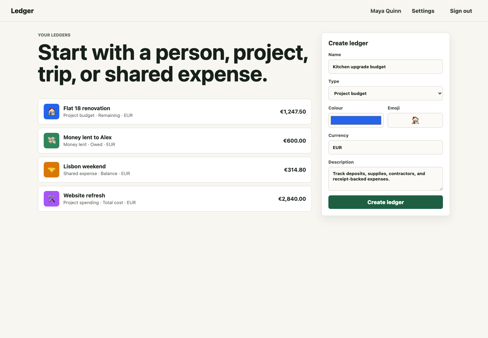
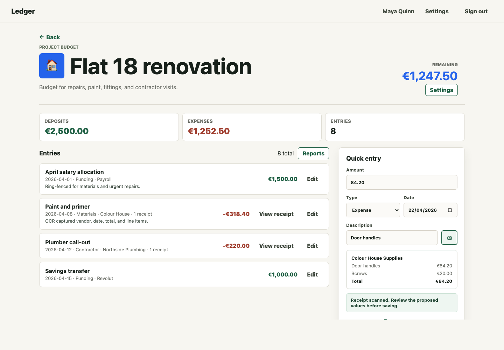
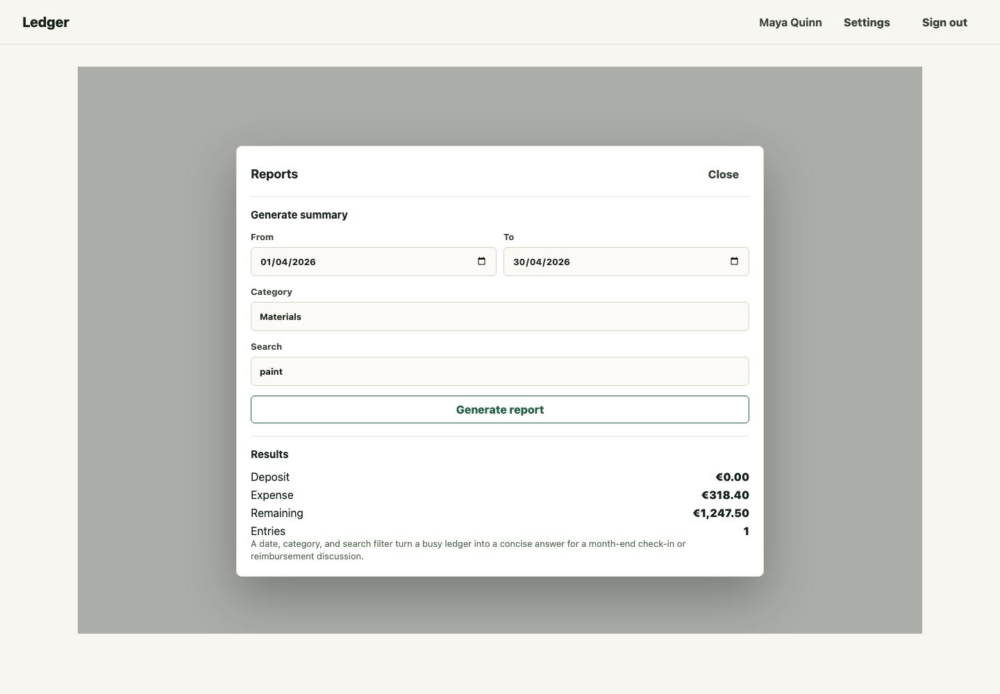
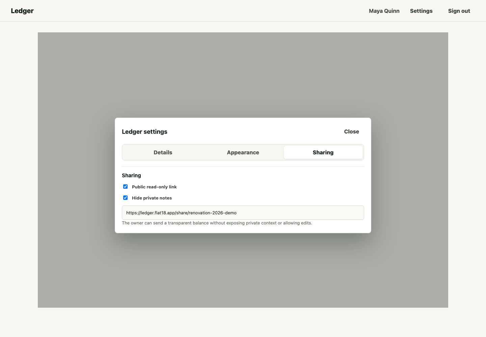
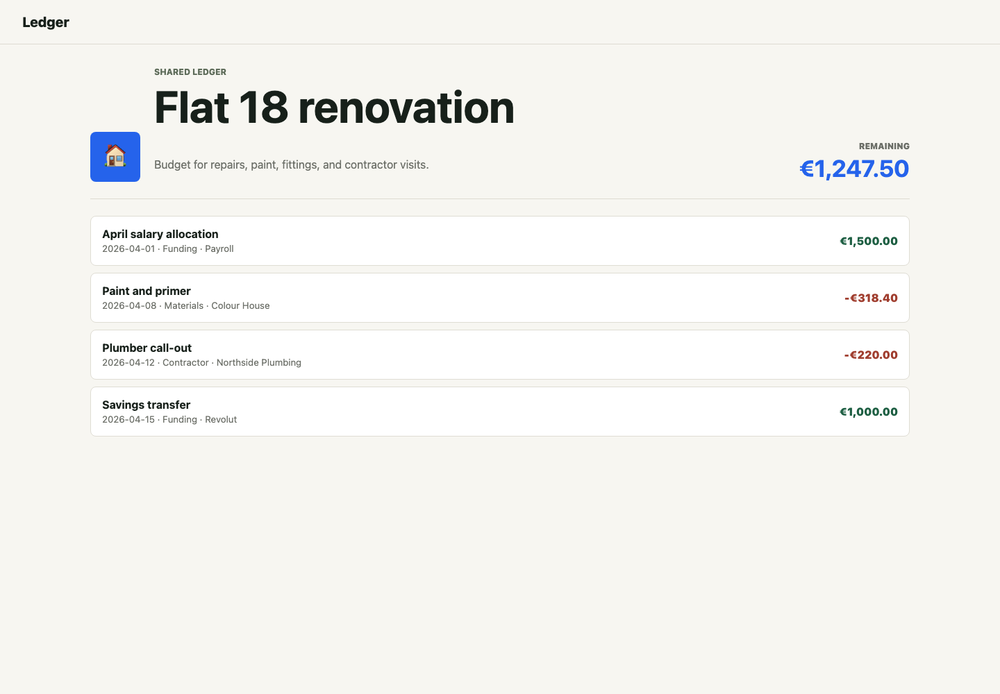

# Ledger Case Study: Simple Money Tracking That People Can Trust

Ledger is a lightweight web app for tracking money-related activity without requiring accounting knowledge. It gives individuals, freelancers, households, and small groups a fast way to create a clear running record for informal loans, project budgets, shared expenses, and receipt-backed spending.

Live app: [https://ledger.flat18.app](https://ledger.flat18.app)

This case study uses representative populated UI samples from the Ledger product experience for website marketing. The sample scenario follows a home renovation budget, while also showing how the same live app supports money lent to a friend, shared trips, and project spending.

## Executive Summary

Many real-world money situations are too important for scattered notes, but too small or informal for full accounting software. A person lending money to a friend, tracking a home repair budget, collecting receipts for a freelance project, or sharing costs with a group needs clarity, context, and trust. They usually do not need ledgers, journals, chart-of-account structures, or a complex finance workflow.

Ledger solves that gap with a structured, plain-language record available at `ledger.flat18.app`. Each ledger is created around a person, project, trip, or shared expense. Entries can be added quickly with an amount, direction, date, and description. Optional fields capture category, vendor, line items, receipt images, private notes, and repayment application. The app keeps totals visible, preserves change history, supports simple reporting, and lets owners share a read-only public link while hiding private notes.

The result is a product that feels closer to a dependable shared note than a finance system, while still providing the structure needed to answer the most important question: what happened, when, and what is the balance now?

## Product Positioning

Ledger is for people who need a trustworthy money record, not an accounting package.

Primary audiences include:

- Individuals tracking money lent, repayments, and outstanding balances.
- Homeowners or renters managing repairs, improvements, deposits, and receipts.
- Freelancers tracking project costs, refunds, and reimbursable expenses.
- Small groups tracking shared spending for trips, households, events, or one-off projects.
- Anyone who wants to send a transparent read-only money record without inviting edits.

The product promise is simple: start with a real-life situation, record money as it happens, and keep a shareable balance that both sides can understand.

## The Problem

Informal money tracking is often split across messages, banking apps, paper receipts, screenshots, and memory. That creates predictable problems:

- Balances become hard to explain when payments and expenses happen over weeks or months.
- Receipts are separated from the entry they support.
- A repayment may need context, such as whether it applies to a specific older loan or the whole balance.
- Corrections can create doubt if the old value disappears without a trace.
- Sharing a spreadsheet can expose private notes or allow accidental edits.
- Existing accounting tools add overhead and unfamiliar terms for simple personal workflows.

The emotional problem is as important as the operational one. Money conversations can become tense when records are incomplete. Ledger reduces that tension by making the record visible, structured, and easy to share.

## The Solution

Ledger organizes money tracking around dedicated ledgers. Each ledger has a type, visual identity, currency, balance label, and plain-language entry labels. For example, a project budget uses "Deposit", "Expense", and "Remaining". A money-lent ledger uses "Money lent", "Repayment", and "Owed".

This type-specific language makes the app feel natural to non-accountants. Users do not need to translate debit and credit concepts. They choose the situation they are tracking, and the interface uses words that match it.

The ledger list also shows why the product scales across everyday use cases. One user can maintain a renovation budget, an informal loan, a shared weekend trip, and a project-spending ledger in the same account without each workflow feeling generic or forced.

## Core Product Workflows

### 1. Create Purpose-Built Ledgers

The create-ledger flow starts with a name and type. Templates automatically provide the right balance label, action labels, emoji, and color. Users can personalize the visual identity so ledgers are easy to recognize at a glance.

This matters for repeat use. A busy user should not need to read every row carefully to find the right record. A project, person, or trip should be visually distinct.

### 2. Add Entries Quickly

The most important action is adding a new entry. Ledger keeps quick entry visible on the detail screen, with only the essential fields required:

- Amount.
- Type.
- Date.
- Description.

Advanced context is optional. Users can add vendor, category, item details, private notes, and payment application only when needed.

In the renovation example, the owner can see the current remaining budget, deposits, expenses, recent entries, and a prepared receipt-backed expense in one view. The interface supports fast capture while preserving enough detail for later review.

### 3. Attach Receipts and Use OCR Suggestions

Receipts are often the evidence behind an entry, but they are usually stored separately. Ledger connects receipt images directly to the expense they support. Client-side OCR can propose amount, date, vendor, and line-item details, which the user can review before saving.

This makes Ledger useful beyond simple totals. It gives users a retrievable record for reimbursements, project reviews, household discussions, and budget checks.

### 4. Preserve Trust With Version History

Money records need correction, but corrections should not silently erase the past. Ledger supports entry edits through versioning. When an entry changes, a new version is created and the previous value remains available through history.

This provides a practical trust model for informal records:

- Users can fix mistakes.
- The reason for a change can be recorded.
- Older versions remain inspectable.
- The balance effect of a change can be understood.

For personal and small-group money tracking, this is often more valuable than rigid accounting controls. It gives users confidence that the shared record is not being rewritten invisibly.

### 5. Filter and Summarize With Reports

When a ledger grows, users need answers, not just a long list. Reports allow filtering by date range, category, and search text, then summarize added value, reduced value, balance, and entry count.

This helps users answer practical questions:

- How much did we spend on materials this month?
- What repayments happened in February?
- Which vendor entries are connected to this project?
- How much of the budget remains after a specific category of spending?

The reporting workflow stays intentionally small. It gives useful summaries without turning the product into business intelligence software.

### 6. Share Read-Only Links Safely

Many ledger records need to be shared with someone else: a friend who owes money, a roommate, a project partner, or a person reviewing expenses. Ledger supports public read-only links per ledger.

Sharing is controlled by the owner:

- Public links are off by default.
- A link can be enabled for one ledger.
- A link can be disabled later.
- Private notes can be hidden from the shared view.

Shared links use the live Ledger domain, for example `https://ledger.flat18.app/share/...`, so recipients can open a clean read-only view without creating an account.

The public view focuses on the shared facts: description, date, category, vendor, amount, and balance. It intentionally removes owner controls and private context.

This gives owners a clean way to communicate the current state of a ledger without exposing sensitive notes or inviting accidental edits.

## Usefulness by Scenario

### Home Renovation Budget

A user creates a renovation ledger and adds deposits from salary or savings. Each supplier visit, contractor call-out, and receipt-backed purchase reduces the remaining budget. The owner can filter reports by materials, contractors, or dates and share a read-only view with a partner.

The solution provided:

- A current remaining balance.
- Receipts connected to expenses.
- Category summaries for budget decisions.
- Private notes for owner-only context.
- A shareable record for transparency.

### Money Lent to a Friend

A user records each amount lent and each repayment. A repayment can apply to the whole ledger or to a specific earlier entry. Notes can capture human context, such as an agreed repayment plan, without appearing on the public link.

The solution provided:

- A clear amount owed.
- A repayment history that avoids memory-based disputes.
- Optional private notes for sensitive context.
- Version history for corrections.
- A read-only view that both people can inspect.

### Freelance or Project Spending

A freelancer tracks project expenses, supplier receipts, refunds, and reimbursable costs. Reports help produce a summary for a client or for internal review.

The solution provided:

- A structured project cost record.
- Receipt-backed entries.
- Vendor and category tracking.
- Searchable expense context.
- Lightweight reporting without spreadsheet maintenance.

### Shared Trips and Household Costs

A group can track expenses and contributions around a shared event, trip, or household project. The ledger creates a single source of truth that can be sent to participants.

The solution provided:

- A transparent shared balance.
- A timeline of spending and contributions.
- Clear labels that match the situation.
- A read-only link for participants.

## Differentiators

Ledger is intentionally not a traditional accounting tool. Its differentiation comes from focusing on everyday money records:

- Plain-language labels adapt to the ledger type.
- Quick entry keeps the main workflow fast.
- Receipts and OCR add evidence without slowing down simple entries.
- Private notes preserve context without oversharing.
- Version history makes corrections trustworthy.
- Public sharing is read-only and controlled per ledger.
- Reports answer practical questions without overwhelming users.

This makes the app suitable for people who want structure and trust, but not accounting complexity.

## Marketing Narrative

Ledger helps users turn messy money situations into clear, shareable records. Instead of relying on memory, chat threads, or spreadsheets, users can create a dedicated ledger for each person, project, trip, or budget. Every entry adds context to the balance: what happened, when it happened, who or what it involved, and whether there is a receipt attached.

The app is especially useful when money needs explanation. A balance alone is rarely enough. People need to know why the balance changed, what evidence supports it, and whether private context should stay private. Ledger gives users that control.

For the website, the strongest message is:

> Keep a simple, trustworthy record of money lent, spent, repaid, and shared.

Supporting messages:

- Track real-life money situations without accounting jargon.
- Add entries quickly and attach receipts when detail matters.
- Share a read-only balance while keeping private notes hidden.
- Preserve trust with version history and clear corrections.
- Turn busy ledgers into useful summaries with simple reports.

## Business Value

Ledger can reduce friction in situations where informal money records often fail. For users, the value is clarity, speed, and confidence. For a marketing website, the app can be positioned around practical trust:

- It helps users avoid forgotten repayments and unclear balances.
- It gives households and groups a shared source of truth.
- It helps freelancers and project owners collect costs in one place.
- It keeps receipts and line-item context attached to the relevant entry.
- It gives recipients a clean view without exposing owner-only details.

The product occupies a useful space between a note, a spreadsheet, and an accounting tool. It keeps the simplicity of a note, the structure of a spreadsheet, and enough auditability to make the record credible.

## Suggested Website Sections

### Hero Message

Simple ledgers for money lent, spent, repaid, and shared.

Supporting copy:

Create a clear running record for informal loans, project budgets, shared expenses, and receipt-backed spending at `ledger.flat18.app`. Add entries quickly, keep private context private, and share a read-only view when someone else needs to see the balance.

### Feature Highlights

- Purpose-built ledgers for people, projects, trips, and budgets.
- Fast entry with plain-language labels.
- Receipt upload with OCR-assisted suggestions.
- Editable entries with preserved version history.
- Filtered reports for dates, categories, and search terms.
- Read-only public sharing with private-note controls.

### Proof Points

- Designed for everyday users, not accountants.
- Keeps the current balance and supporting history together.
- Helps turn sensitive money conversations into factual records.
- Supports multiple real-life use cases from one simple ledger engine.

## Asset Inventory

Included screenshot assets:

- `screenshots/list.png`: Populated ledger list and create-ledger workflow.
- `screenshots/detail.png`: Ledger detail view with entries, balance, and receipt-assisted quick entry.
- `screenshots/report.png`: Report modal with filters and summarized results.
- `screenshots/sharing.png`: Sharing settings with read-only link and hidden private notes.
- `screenshots/public.png`: Public read-only shared ledger view.

Supporting source:

- `screenshot-mockups.html`: Static source used to render the populated screenshot samples from the app's existing visual language.

Production URL:

- `https://ledger.flat18.app`: Live Ledger application.

## Closing Summary

Ledger gives people a practical way to manage money records that are too personal, small, or contextual for accounting software, but too important for memory or scattered notes. By combining fast entry, receipt support, version history, reporting, and controlled sharing, it creates a trustworthy record for everyday money situations.

The product's usefulness comes from respecting how people actually track money: around people, projects, receipts, repayments, and conversations. Ledger turns those moments into clear balances and shareable records.
