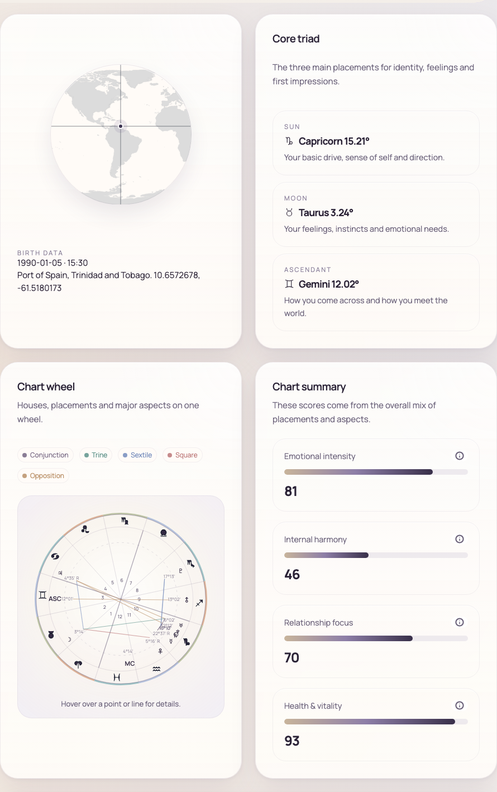
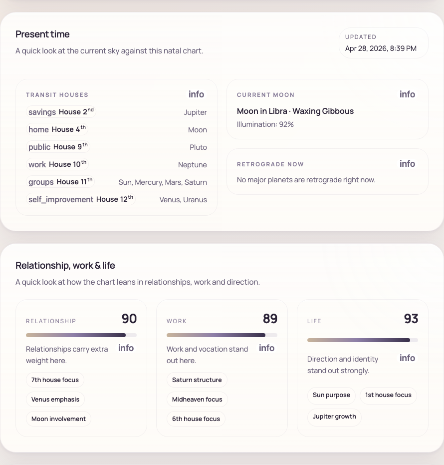
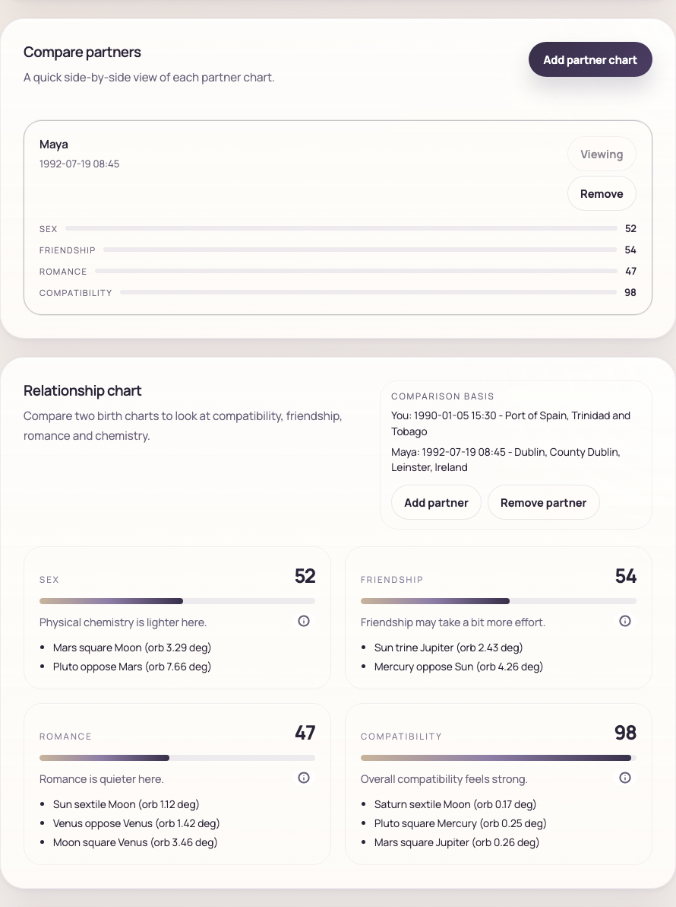
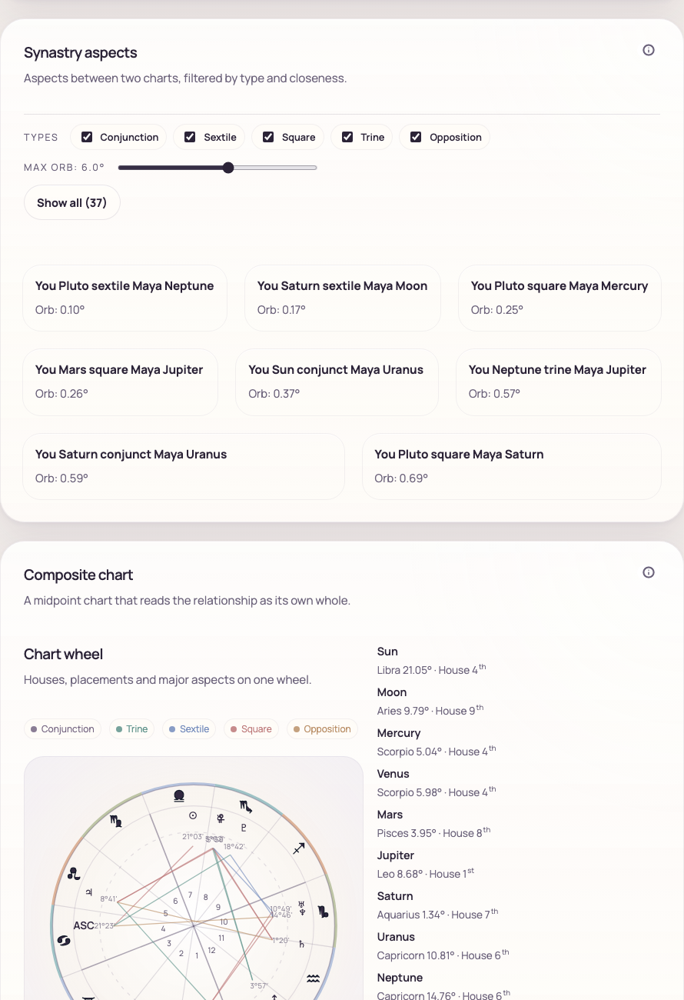
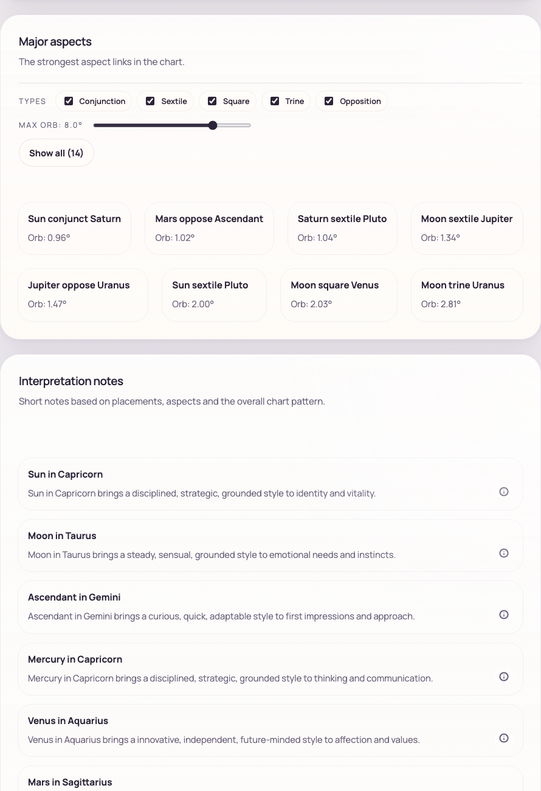

# Case Study: Natal Chart App by Flat 18

Live product: https://natal-chart.flat18.app/

## Executive summary

The Natal Chart App by Flat 18 turns a highly technical astrology workflow into a clear, self-guided browser experience. A user can enter birth details, resolve a birthplace, generate a Swiss Ephemeris-based chart, read plain-language interpretations, compare a partner chart, review current transits, and export a shareable report from one interface.

The app is useful because it reduces the friction between curiosity and insight. Traditional chart tools often assume that users already understand ephemerides, houses, aspects, time zones, and relationship techniques. This product keeps the calculation layer accurate while translating the output into scannable sections, visual summaries, and approachable readings.

For Flat 18, the project is also a strong proof point: complex data products do not need to feel complex. With the right structure, even a dense symbolic system can become a polished product that supports exploration, comparison, trust, and repeat use.

## The problem

Natal chart generation sounds simple from the outside: enter a birthday and get a chart. In practice, the product has to coordinate several layers of data and interpretation:

- Birthplace input must become latitude and longitude.
- Local birth time must be resolved against the correct time zone.
- Chart calculation needs accurate planetary positions, houses, angles, retrogrades, and aspects.
- The output has to be understandable to people who may not know astrology terminology.
- Advanced users still expect enough detail to inspect placements, houses, aspect orbs, and comparison data.
- A marketing-friendly product needs to feel credible, calm, and visually complete, not like a raw calculation dump.

The common failure mode for astrology tools is either too little depth or too much unexplained data. Flat 18 solved for the middle: accurate calculations, structured detail, and a front end that shows the most useful information first.

## The solution

The app guides users through a full chart workflow:

1. Enter birth date, birth time, birthplace, and house system.
2. Resolve the birthplace into coordinates and infer the correct time zone.
3. Convert local birth time to UTC before calculating the chart.
4. Generate placements, house cusps, angles, aspects, scores, focus areas, and interpretation notes.
5. Add a partner chart for relationship scoring, synastry aspects, and a composite chart.
6. Export the generated result as a PDF.

The experience is designed around progressive disclosure. A user can get value from the first screen by reading the core triad and summary scores, then go deeper into current transits, focus areas, aspects, tables, synastry, and interpretations as needed.

## Product usefulness

### Fast self-service chart generation

The app gives users a complete chart without requiring software installation, account setup, or manual ephemeris lookup. It works directly in the browser and supports standard inputs people already understand: date, time, place, and house system.

This is useful for:

- Beginners who want a guided introduction to their chart.
- Astrology readers who need a fast reference chart.
- Content creators who need shareable chart material.
- Consultants who want a lightweight client-facing chart generator.
- Product teams looking for an example of how to turn complex calculations into an approachable interface.

### Trustworthy calculation pipeline

The chart is calculated with Swiss Ephemeris through WebAssembly. The app handles time-zone resolution, UTC conversion, house-system selection, planetary positions, angles, retrogrades, aspects, and derived scores.

That matters because astrology tools are only as useful as their inputs. A clean interface is not enough if the birth time, location, or house system is mishandled. The app keeps those technical steps visible enough to build trust, while keeping them simple enough that the user does not need to manage the calculation process manually.

### Clear reading hierarchy

The interface starts with the highest-signal material:

- Birth data and location confirmation.
- Core triad: Sun, Moon, and Ascendant.
- Visual chart wheel.
- Summary gauges for emotional intensity, internal harmony, relationship focus, and health/vitality.

This hierarchy helps users quickly answer the first questions they usually bring to a chart: what are my main placements, what does the chart emphasize, and where should I look next?

### Present-time context

The app includes a present-time panel that compares the current sky with the natal chart. It shows active transit houses, current Moon phase, illumination, and retrograde status.

This makes the product more useful than a static birth-chart generator. Users can return to the app and see how current planetary movement is activating different areas of the natal chart.

### Relationship and compatibility analysis

The relationship workflow turns a single-user chart app into a comparison tool. Users can add a partner chart, view compatibility categories, inspect relationship highlights, review synastry aspects, and open a composite chart.

The categories are intentionally simple:

- Sex
- Friendship
- Romance
- Compatibility

Each category includes a score, a plain-language summary, and supporting cross-chart aspect highlights. This lets the user see both the headline and the reasoning behind it.

### Synastry and composite chart depth

For users who want more than summary scores, the app exposes cross-chart synastry aspects and a composite chart. Synastry shows how placements from two charts interact. The composite chart treats the relationship as its own chart by calculating midpoints.

This is a strong example of progressive depth: the app keeps the first relationship view simple, then gives experienced users a path into the underlying data.

### Interpretation notes and detailed data

The app includes placement notes, major aspects, and interpretation blocks generated from the calculated chart. Users can scan the strongest aspect links, then read short summaries for placements and chart patterns.

This solves an important usability problem: raw placements are not enough for most users. The app turns calculated results into readable material without hiding the underlying structure.

## Key features

- Browser-based natal chart generation.
- Birthplace geocoding with coordinate confirmation.
- Automatic time-zone handling with optional manual override.
- Placidus, Whole Sign, and Koch house-system options.
- Swiss Ephemeris chart calculation in WebAssembly.
- Planetary placements, houses, Ascendant, Midheaven, retrograde state, and aspects.
- Visual chart wheel with aspect legend.
- Core triad summary for Sun, Moon, and Ascendant.
- Summary scoring across major chart themes.
- Element and mode distribution panels.
- Current transit houses, Moon phase, illumination, and retrograde status.
- Relationship comparison with multiple scoring categories.
- Synastry aspects between two charts.
- Composite chart for relationship-level interpretation.
- Placement table, aspect list, and interpretation notes.
- About and privacy modals explaining method, trust, and data handling.
- PDF export for sharing, client records, or personal reference.

## Design approach

The design avoids the usual extremes of astrology products. It is not a dense technical dashboard, and it is not a vague horoscope page. The interface uses a calm editorial style, structured cards, clear labels, and direct explanations.

The main design choices are:

- Put user inputs next to generated outputs so the chart feels traceable.
- Use visual anchors, such as the map and chart wheel, to make the result feel concrete.
- Use cards for individual feature areas rather than one long unstructured report.
- Keep explanatory copy short at the panel level, then provide deeper information through modals or expandable sections.
- Use scores and tags to make complex themes scannable.
- Preserve detailed lists for advanced users who want to inspect aspects, placements, houses, and orbs.

This makes the app suitable for both casual exploration and more serious chart review.

## Technical approach

The product is built with Vue and Vite, with the astrology layer handled in browser-based JavaScript. Swiss Ephemeris runs through `swisseph-wasm`, which allows the app to calculate charts without sending birth data to a chart-calculation server.

Important technical decisions include:

- Using geocoding to convert birthplace input into latitude and longitude.
- Using coordinate-based time-zone lookup before UTC conversion.
- Supporting multiple house systems at calculation time.
- Building aspects from calculated longitudes rather than static lookup tables.
- Deriving summary metrics and focus areas from placements and aspects.
- Keeping chart generation and reading generation in the same client-side workflow.
- Using `html2canvas` and `jspdf` to produce an exportable PDF from the rendered report.

The result is a product that feels lightweight to the user but still has a serious calculation model underneath it.

## Privacy and trust

The app is designed so most of the work happens locally in the browser. Birth date, birth time, chart results, relationship readings, and interpretation notes are not stored by the app.

The only part that requires a third-party request is birthplace lookup, where the entered location is sent for geocoding. After coordinates are resolved, chart calculation and reading generation happen in the browser.

The app also distinguishes between calculation and interpretation. Planetary positions and houses are calculated from astronomical data. The written meanings are symbolic interpretations intended for reflection, not deterministic claims.

This positioning is important for marketing because it gives users a reason to trust the product without overstating what astrology itself can prove.

## Why the app matters

The app gives users practical answers:

- What are my main chart placements?
- What themes stand out in my chart?
- How do my placements distribute across elements and modes?
- What current transits are activating my chart?
- How does another person’s chart compare with mine?
- Which synastry aspects are strongest?
- What does the relationship look like as a composite chart?
- Can I save or share the result?

That usefulness is what makes the app more than a visual demo. It helps users move from raw birth data to a coherent, navigable report.

## Marketing positioning

### Primary message

Flat 18 turns complex data into useful products.

### Supporting message

The Natal Chart App takes technical ephemeris data, time-zone logic, relationship scoring, and interpretive content, then presents it as a clean browser product that users can understand without training.

### Short website copy

The Natal Chart App by Flat 18 transforms birth data into a complete astrology report with accurate chart calculation, current transit context, relationship comparison, and exportable results.

### Value propositions

- Accurate calculations without a heavy interface.
- Plain-language readings backed by inspectable chart data.
- Relationship tools that combine summary scores with deeper synastry.
- A polished product experience from a complex calculation pipeline.
- Privacy-conscious browser-based chart generation.

## Reusable product patterns

The app is astrology-specific, but the product pattern applies to many domains:

- Intake form to normalize user inputs.
- Calculation layer to transform data into structured outputs.
- Summary layer to surface the most useful signals.
- Detail layer for advanced inspection.
- Comparison layer for multi-person or multi-record analysis.
- Export layer for shareable artifacts.

That same pattern can be used for finance, health, education, research, assessments, planning tools, recommendation engines, and any product where raw data needs to become something people can act on.

## Sample data used for screenshots

Primary chart:

- Date: 1990-01-05
- Time: 15:30
- Location: Port of Spain, Trinidad and Tobago
- House system: Placidus

Partner chart:

- Label: Maya
- Date: 1992-07-19
- Time: 08:45
- Location: Dublin, Ireland
- House system: Whole Sign

Screenshots were generated from the local app UI on April 28, 2026.

## Asset inventory

- `screenshots/01-chart-overview.png`
- `screenshots/02-transits-focus.png`
- `screenshots/03-relationship-comparison.png`
- `screenshots/04-synastry-composite.png`
- `screenshots/05-interpretation-notes.png`

