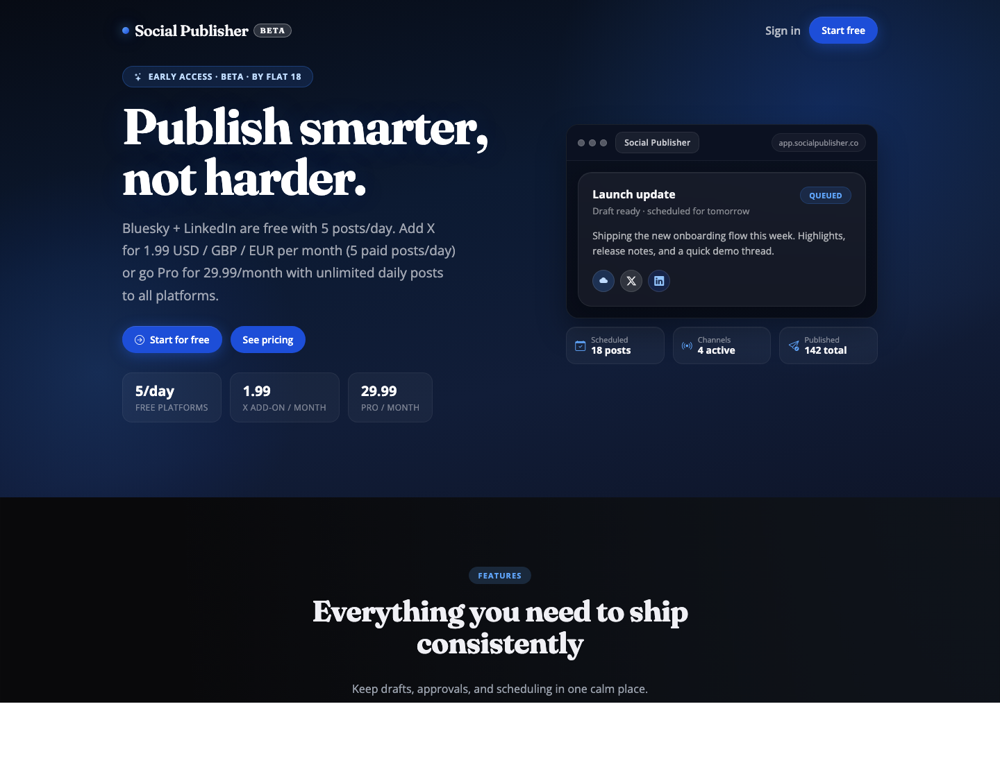
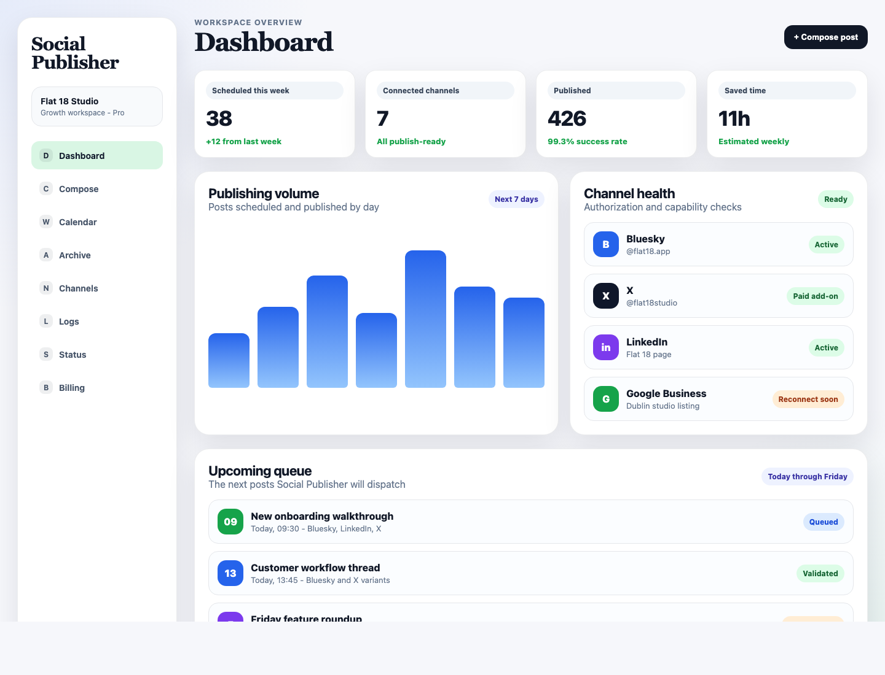
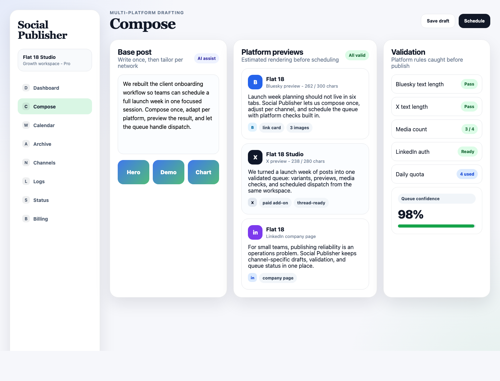
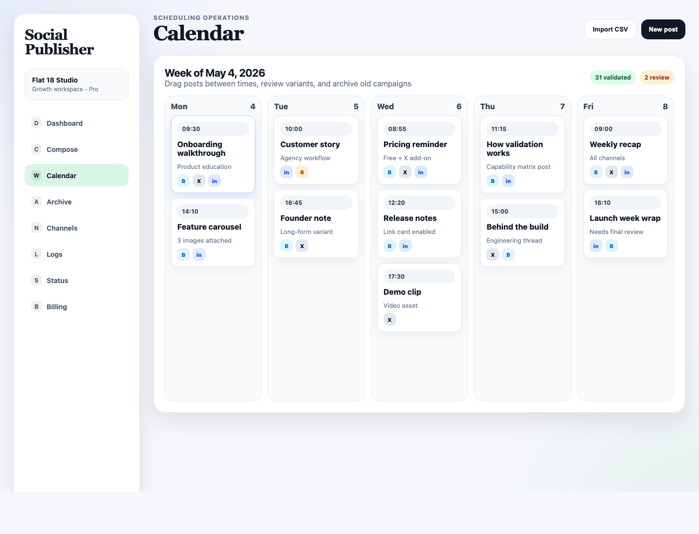
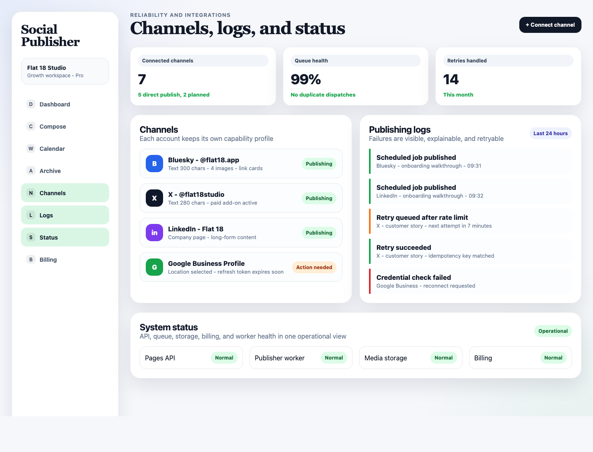

# Social Publisher by Flat 18: Case Study

**Live product:** [https://social-publisher.flat18.app](https://social-publisher.flat18.app)  
**Category:** Social media publishing, scheduling, and workflow operations  
**Audience:** Founders, solo creators, small marketing teams, agencies, community managers, and lean product teams  
**Status:** Live beta  
**Positioning:** A focused social publishing workspace for teams that need dependable scheduling without enterprise complexity.

## Executive Summary

Social Publisher is a multi-platform social publishing app created by Flat 18 to make recurring content operations easier to run. It gives small teams one place to compose posts, tailor platform-specific variants, validate content against platform rules, schedule a publishing queue, and monitor outcomes after posts are dispatched.

The product solves a common operational problem: social publishing looks simple from the outside, but the daily workflow is fragmented. Teams often jump between drafts, platform tabs, calendars, approval notes, image folders, AI tools, and manual reminders. Every extra handoff creates a chance for missed posts, duplicated posts, broken formatting, expired credentials, or platform-specific mistakes.

Social Publisher turns that scattered workflow into a single, structured publishing system. Users can connect channels, create a base post, customize the copy for each destination, preview estimated platform output, schedule content on a calendar, and review logs when jobs succeed, fail, or need retrying.

The result is a calmer, more reliable way to ship content consistently.

## The Challenge

For lean teams, content publishing is usually a high-frequency workflow managed with low-structure tools. A launch week, product announcement, event campaign, or recurring educational series may involve dozens of posts across several platforms. Even when the content strategy is clear, execution can become difficult because each platform behaves differently.

Common pain points include:

- Content has to be rewritten for each network because character limits, tone, formatting, media support, and link behavior differ.
- Teams need a calendar view, but they also need the calendar to understand publishing state, not just hold reminders.
- Manual publishing creates risk when a user is busy, offline, or relying on someone else to remember the schedule.
- Connected social accounts can expire, lose permissions, or behave differently depending on API availability.
- Publishing failures are hard to diagnose when logs are spread across platform dashboards, emails, and support messages.
- AI-assisted content generation can help, but bundled AI pricing is often opaque and may not match a team's data preferences.
- Enterprise social suites can be too expensive or too broad for teams that mainly need reliable publishing and scheduling.

Social Publisher was designed around these constraints. It focuses on the core operational loop: connect channels, prepare content, validate it, schedule it, and know what happened.

## The Solution

Social Publisher provides a structured publishing workspace that makes platform differences explicit before posts are scheduled.

The app centers on six product ideas:

1. **Compose once, customize per platform.** Users create a base post and adapt variants for channels such as Bluesky, X, LinkedIn, and other planned integrations.
2. **Validate before publishing.** Platform rules are checked early, including text length, media limits, link behavior, authorization state, and entitlement limits.
3. **Preview with context.** Estimated previews help users understand how a post may appear before it goes into the queue.
4. **Schedule from an operational calendar.** The calendar is not just a planning surface. It shows publishing state, selected posts, scheduled jobs, and review needs.
5. **Make reliability visible.** Logs, status views, retry behavior, and channel health expose what happened when a scheduled post was dispatched.
6. **Keep AI flexible.** Bring-your-own AI provider support gives teams access to AI assistance without forcing a bundled model cost or locking their workflow into one provider.

## Product Usefulness

Social Publisher is useful because it reduces the amount of coordination required to publish consistently. It does not try to replace a marketing strategy. It makes the execution layer easier to manage.

For a founder, it can turn scattered announcement notes into a full week of scheduled posts.

For a small marketing team, it can centralize campaign publishing so team members do not need to ask which channels are ready, whether the LinkedIn variant was reviewed, or whether the X post fits within the text limit.

For an agency, it can make workspace-based publishing easier to reason about by separating channels, schedules, logs, and billing readiness.

For a product team, it can support launch communication with a repeatable process: write, adapt, validate, schedule, observe.

The app is especially valuable for teams that want the practical benefits of a social scheduling suite without paying for a large enterprise platform or adopting a tool that hides platform rules until publish time.

## Feature Highlights

### Dashboard and Workspace Overview

The dashboard gives users a fast read on publishing operations. It surfaces scheduled posts, connected channels, publishing volume, upcoming queue items, and channel health. This helps teams understand the current state of their content pipeline without opening every feature area individually.

Marketing value:

- Gives users confidence that scheduled content is under control.
- Makes channel readiness visible before publishing day.
- Turns a social calendar from a static planning artifact into an operational dashboard.

### Composer, Variants, and Validation

The composer is built around the reality that a post should not always be identical on every platform. Social Publisher lets users start with a base post, then refine variants for each connected channel.

Validation gives practical feedback before the post is published. Instead of letting a user discover a character limit or media issue at dispatch time, the app checks platform constraints earlier in the workflow.

Key benefits:

- Reduces last-minute formatting fixes.
- Helps users adapt copy for platform context.
- Makes text limits and media limits visible.
- Gives teams a more reliable path from draft to scheduled post.
- Supports AI-assisted drafting while preserving human review.

### Scheduling Calendar

The calendar gives teams a weekly view of what is going out and when. Scheduled items can be reviewed by campaign, channel, time, and publishing state.

This matters because social publishing is not only about writing posts. It is also about pacing. A good calendar helps teams avoid content gaps, channel overload, duplicated announcements, and poorly timed updates.

Key benefits:

- Makes the publishing queue easy to scan.
- Helps teams balance content across the week.
- Supports campaign planning and day-by-day scheduling.
- Allows future publishing operations to be reviewed before they happen.
- Provides a natural home for CSV-based bulk scheduling and LLM-assisted planning workflows.

### Channels, Logs, and Status

Social publishing reliability depends on more than the content itself. The system needs to know which channels are connected, what each platform supports, whether credentials are healthy, and what happened during each dispatch.

Social Publisher includes channel management, publishing logs, and status surfaces so teams can see the operational layer behind the schedule.

Key benefits:

- Makes account authorization state visible.
- Separates platform capability from user guesswork.
- Gives users a place to inspect failures and retry outcomes.
- Helps teams distinguish content problems from credential or platform problems.
- Builds trust by exposing queue health rather than hiding it.

## Workflow

The core workflow is intentionally direct:

1. Connect social channels.
2. Create a base post.
3. Select the target platforms.
4. Customize variants where needed.
5. Attach media and links.
6. Validate the post against channel rules.
7. Preview estimated platform output.
8. Publish now or schedule for later.
9. Monitor the calendar, logs, and status views.

This workflow is designed to keep content moving while reducing avoidable publishing errors.

## Differentiators

Social Publisher stands out because it focuses on the practical publishing workflow rather than trying to become an all-purpose marketing suite.

Important differentiators include:

- **Platform-aware validation:** The app treats platform differences as first-class product behavior.
- **Lean team fit:** Pricing and workflow are designed for smaller teams that need structure without enterprise overhead.
- **Operational transparency:** Logs, retries, channel health, and status views make publishing reliability visible.
- **BYO AI support:** Users can bring their own AI provider keys for more control over cost and data boundaries.
- **Calendar-first scheduling:** The queue is organized around a working calendar, not only a list of posts.
- **Capability-driven architecture:** Platform support can evolve as social APIs change.
- **Bulk scheduling readiness:** CSV import and LLM-ready planning flows can help users populate a content calendar faster.

## Solutions Provided

### Reduces Publishing Friction

Users can move from idea to scheduled post without switching between writing tools, platform tabs, spreadsheets, and reminders.

### Prevents Common Platform Mistakes

The validation layer helps catch issues such as text length, media count, media type, authorization state, and entitlement limits before dispatch.

### Improves Consistency

A visible calendar and queue make it easier to publish regularly across channels instead of posting reactively.

### Supports Better Team Collaboration

Even small teams need shared context. The dashboard, previews, schedule, and logs make it easier for another team member to understand what is ready, what needs review, and what has already shipped.

### Makes Failures Actionable

Publishing failures happen because APIs, credentials, rate limits, and platform policies change. Social Publisher makes these issues easier to inspect and recover from by surfacing logs and retry state.

### Keeps Costs Predictable

The product is positioned around accessible pricing and bring-your-own AI support, helping smaller teams avoid paying for features or model usage they do not need.

## Example Marketing Narrative

Social Publisher helps small teams ship social content with the discipline of a larger marketing operation. Instead of juggling drafts, platform tabs, calendars, and manual reminders, teams get one workspace for channel connections, platform-aware drafting, previews, scheduling, and logs.

Compose once, tailor per platform, validate before publishing, and schedule with confidence.

## Ideal Website Sections

These case study sections can be adapted into a marketing website page:

- **Hero:** "Publish smarter, not harder."
- **Problem:** "Social publishing breaks down when drafts, calendars, platform rules, and credentials live in different places."
- **Solution:** "One workspace for composing, validating, scheduling, and tracking social posts."
- **Feature proof:** Dashboard, composer, calendar, and reliability screenshots.
- **Use cases:** Launch campaigns, recurring education, founder-led content, agency scheduling, product updates.
- **Differentiators:** Platform-aware validation, transparent logs, BYO AI, calendar-first scheduling.
- **Call to action:** "Start for free" or "Plan your next content week."

## Suggested Website Copy

### Short Summary

Social Publisher is a focused scheduling workspace for teams that want to publish consistently across social platforms without enterprise complexity. Create posts, tailor channel variants, validate platform rules, schedule content, and monitor the queue from one app.

### Benefit-Led Copy

Publishing should not depend on a spreadsheet, a reminder, and five browser tabs. Social Publisher gives teams a structured workflow for turning campaign ideas into scheduled, validated posts across connected channels.

### Feature-Led Copy

Connect your channels, compose a base post, customize per-platform variants, attach media, preview estimated output, and schedule posts on a calendar. Logs and status views keep the publishing pipeline visible after content enters the queue.

### CTA Options

- Start for free
- Schedule your next post
- Build your content queue
- Try Social Publisher

## Impact Potential

The clearest impact of Social Publisher is operational. The product can help reduce time spent switching contexts, lower the risk of avoidable publishing errors, and give small teams a more professional content workflow.

Potential success metrics to track:

| Metric | Why it matters |
| --- | --- |
| Time to schedule a week of content | Measures workflow efficiency |
| Posts scheduled per active workspace | Shows adoption of the core workflow |
| Validation issues caught before scheduling | Demonstrates error prevention |
| Publishing success rate | Measures operational reliability |
| Retry success rate | Shows resilience of the queue |
| Connected channels per workspace | Indicates platform breadth |
| AI-assisted drafts created | Measures value of BYO AI support |

The screenshots in this case study use representative sample data for marketing presentation. Performance metrics should be replaced with verified production figures before being used as quantified public claims.

## Screenshot Assets

| File | Description |
| --- | --- |
| `./screenshots/00-live-home.png` | Live homepage capture from `https://social-publisher.flat18.app` |
| `./screenshots/01-dashboard-overview.png` | Populated dashboard sample showing metrics, queue, and channel health |
| `./screenshots/02-compose-validation-preview.png` | Populated composer sample showing variants, previews, media, and validation |
| `./screenshots/03-calendar-scheduling.png` | Populated weekly calendar sample showing scheduled posts |
| `./screenshots/04-channels-logs-status.png` | Populated reliability sample showing channels, logs, retries, and status |

## Closing

Social Publisher gives smaller teams a practical way to run social publishing with more structure and less friction. Its value is not only in scheduling posts. Its value is in making the whole publishing workflow easier to trust: from draft, to validation, to calendar, to dispatch, to logs.

For teams that need consistent content execution without heavy enterprise software, Social Publisher provides a clear, useful, and focused solution.
