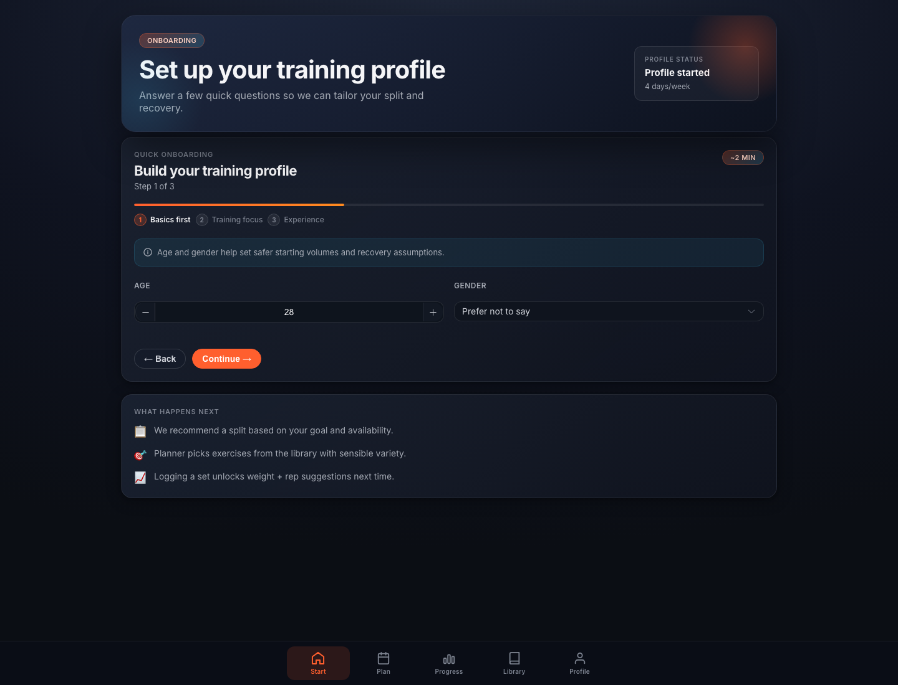
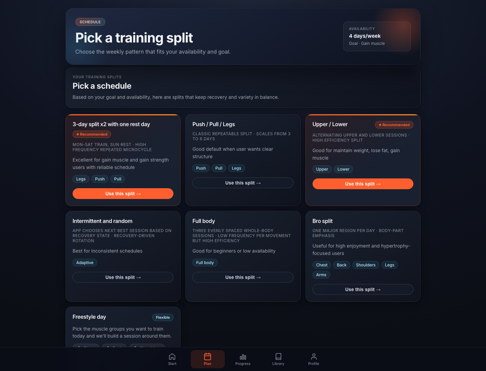
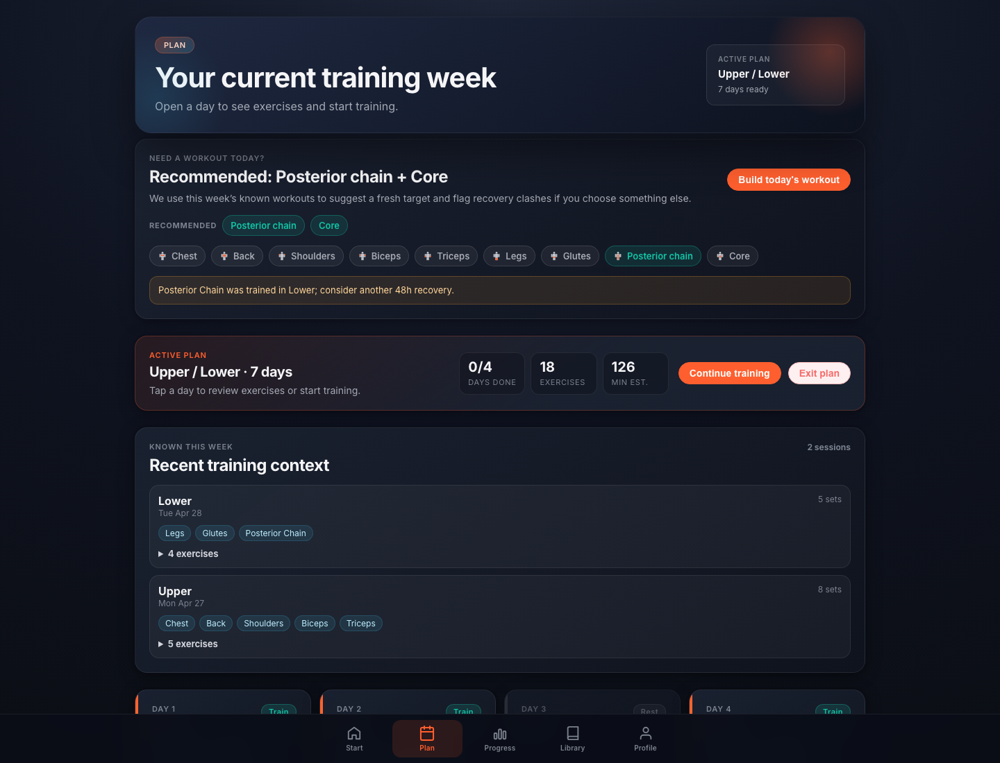
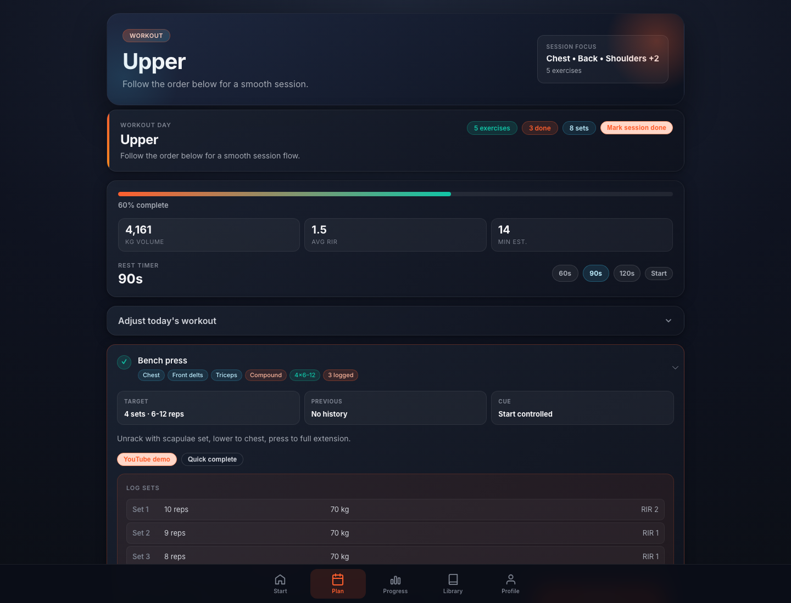
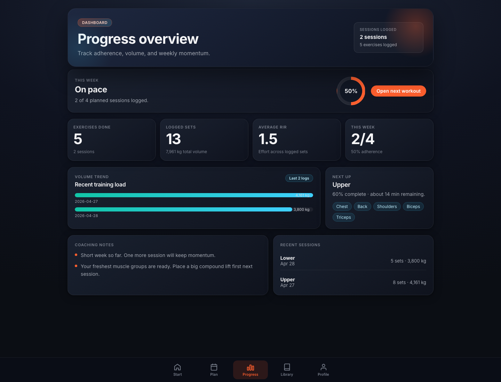
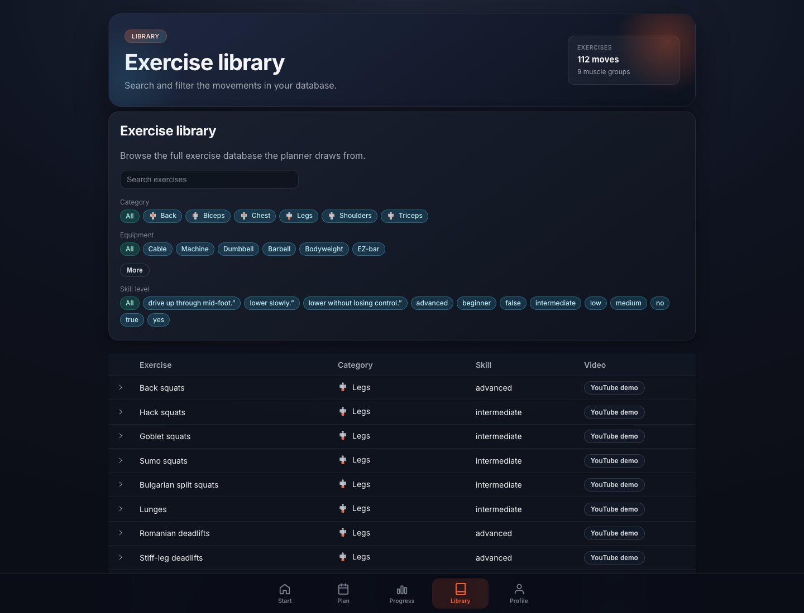
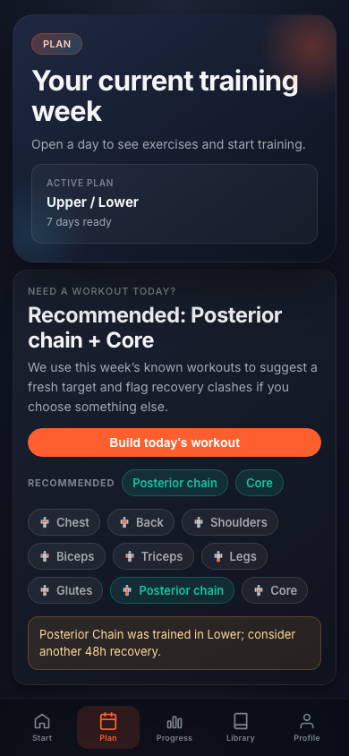

# Workouts Case Study: Turning Workout Planning Into a Practical Training System

## Executive summary

Workouts is a personalized workout planning app designed for people who want structure, consistency, and clear training guidance without needing to design a program from scratch. It combines a guided onboarding flow, goal-aware schedule recommendations, an exercise library, workout generation, set logging, recovery-aware recommendations, and a progress dashboard into one focused training experience.

The app solves a common problem in consumer fitness software: many users know they should train consistently, but they do not know what to train today, how much volume is appropriate, how to adjust when their week changes, or how to translate logged workouts into next-step decisions. Workouts bridges that gap by turning a few profile inputs into a structured week, then keeping the plan flexible enough for real life.

The live app is available at [https://workouts.flat18.app](https://workouts.flat18.app). This case study uses populated UI samples captured from the app experience and presents a realistic marketing scenario: an intermediate trainee focused on gaining muscle, training four days per week on an Upper / Lower split, with two sessions already logged in the active week.

## Live product

- **Live URL:** [https://workouts.flat18.app](https://workouts.flat18.app)
- **Product name:** Workouts
- **Product type:** Browser-based workout planner and logging app.
- **Primary user journey:** Onboard, choose a schedule, generate a plan, complete workouts, log sets, and review progress.
- **Marketing use:** Website case study, feature proof, product screenshots, and conversion-focused product storytelling.

## Product context

Most workout apps fall into one of two categories. Some provide static plans that assume the user has a perfect schedule. Others provide open-ended logging tools that require the user to know exactly what they are doing before they even start. Workouts, live at [workouts.flat18.app](https://workouts.flat18.app), sits between those two extremes.

It helps the user answer practical questions:

- What split should I follow for my goal and availability?
- What should I train today?
- Which exercises should be included in the session?
- How many sets and reps should I aim for?
- What did I do last time?
- Am I on pace this week?
- Should I repeat a muscle group or give it more recovery?

The result is a training companion that supports both structure and adaptability. Users can follow a planned weekly split, generate a quick session when they need one, log sets in detail, or complete exercises quickly when they care more about consistency than granular data.

## The problem

Strength training is simple in theory but complex in practice. A useful plan needs to balance goal, frequency, recovery, exercise selection, progression, and adherence. Many users struggle because the work is fragmented across memory, notes apps, spreadsheets, videos, and generic workout templates.

The main friction points Workouts addresses are:

- **Unclear starting point:** Users often do not know which split is appropriate for their goal, experience, and weekly availability.
- **Static programming:** A plan that works on paper often breaks when the user misses a day, adds a session, or changes focus.
- **Too much decision-making in the gym:** Choosing exercises, sets, reps, rest, and substitutions during a session adds cognitive load.
- **Poor feedback loops:** Logging is valuable only if the app turns history into useful next actions.
- **Low adherence visibility:** Users need to see whether they are on pace before the week is already lost.
- **Exercise discovery gaps:** A planner needs a searchable movement library with equipment, muscle group, skill level, and demo links.

Workouts' solution is to reduce planning overhead while preserving meaningful control.

## The solution

Workouts creates a guided path from first-time setup to weekly execution:

1. The user builds a training profile.
2. The app recommends schedule options based on goal and availability.
3. The user selects a split or creates a freestyle session.
4. The planner generates workout days from reusable templates and the exercise library.
5. The user opens a workout, follows the ordered exercises, and logs sets.
6. The dashboard turns logs into adherence, volume, effort, and coaching signals.
7. The plan can be adjusted as the week changes.

The app is not just a workout list. It is a lightweight training system that helps users make better decisions at the right moment.

## Populated UI samples

### 1. Fast onboarding creates a useful training profile

The onboarding flow asks for only the inputs that meaningfully affect planning: age, gender, goal, intensity, weekly availability, and experience level. This keeps setup short while still giving the planner enough context to recommend a realistic schedule and training volume.

For marketing, this screen communicates that personalization starts quickly. The user does not need to build a program manually or understand programming theory before receiving value.

### 2. Schedule recommendations translate goals into weekly structure

After onboarding, Workouts presents schedule cards such as Push / Pull / Legs, Upper / Lower, intermittent adaptive training, and freestyle options. Recommended cards are highlighted based on the profile.

This solves a high-value planning problem: users can choose from understandable training structures without needing to compare every possible split themselves. The app explains cadence, pattern type, and best-fit use cases, which makes the recommendation feel transparent rather than arbitrary.

### 3. The plan view combines structure with live weekly context

The plan screen shows the active split, training days, estimated session volume, completion progress, and recent weekly training context. It also includes a quick workout builder that recommends fresh muscle groups and warns about recovery clashes.

In the populated example, the app knows the user has already trained Upper and Lower sessions. When Posterior Chain is selected again, the app flags that this muscle group was recently trained and suggests more recovery. This is a useful marketing point because it shows the app is not just listing workouts. It is interpreting the user's week.

### 4. Workout execution supports both detailed logging and low-friction completion

The workout day view gives the user a session-level summary, progress bar, rest timer, target sets and reps, exercise cues, YouTube demo access, quick completion, and detailed set logging.

This design supports two important user modes:

- When the user wants detail, they can log reps, weight, and RIR set by set.
- When the user wants speed, they can mark an exercise complete and keep moving.

That flexibility matters in a gym environment. A good workout app should not punish users for being short on time or training in a busy setting.

### 5. The dashboard turns training history into next actions

The dashboard summarizes weekly adherence, completed exercises, logged sets, total volume, average RIR, recent training load, next workout, coaching notes, and recent sessions.

In the sample data, the user has completed 2 of 4 planned sessions, logged 13 sets, and recorded 7,961 kg of total volume. The dashboard labels the user as "On pace" and points them toward the next workout.

This is where Workouts becomes more than a logger. The app gives the user a clear answer to "What should I do next?" instead of simply storing past workouts.

### 6. The exercise library makes the planner transparent

The library screen exposes the exercise database that powers the planner. Users can search and filter by category, equipment, and skill level. Each exercise can include primary muscles, equipment, pattern, and video demo access.

This builds confidence in generated plans. Users can inspect the source material, discover alternatives, and understand why a movement appears in a session.

### 7. The experience is usable on mobile

The mobile plan view keeps the core workflow available in a gym-friendly layout. The app uses bottom navigation, compact cards, large touch targets, and quick access to the current week.

This matters because the primary usage environment is not a desk. Users are likely holding a phone between sets, checking the next exercise, or logging a set quickly.

## Key features and marketing value

### Guided profile setup

Workouts starts with a short onboarding flow that captures practical training inputs. The profile is simple enough for casual users but meaningful enough to affect downstream recommendations.

Marketing message: **A personalized training week in minutes, without program design guesswork.**

### Goal-aware schedule selection

The app maps the user's goal and availability to schedule options. A user focused on gaining muscle with four available days can be guided toward an Upper / Lower split, while another user with inconsistent availability can use a more flexible pattern.

Marketing message: **The app recommends a training structure that fits the user's real week.**

### Generated weekly plans

Workout days are generated from templates and populated from a structured exercise library. Each day includes target muscle groups, ordered exercises, prescribed sets, rep ranges, and practical session flow.

Marketing message: **Every week starts with a clear plan, not a blank page.**

### Quick workout builder

When the user needs a workout outside the standard plan, they can select muscle groups and build a session for today. The app can recommend fresh groups based on recent training and warn when selected muscles were trained too recently.

Marketing message: **Flexible enough for real life, smart enough to protect recovery.**

### Detailed set logging

Users can record reps, weight, and RIR for each set. This gives the app the data needed to surface volume, effort, and performance trends over time.

Marketing message: **Track the details that matter for progression.**

### Quick completion

Not every user wants to log every set every session. Workouts supports quick completion so users can maintain adherence even when detailed logging is inconvenient.

Marketing message: **Consistency stays easy, even on rushed training days.**

### Session-level guidance

Workout screens include exercise order, target ranges, execution cues, previous performance context, rest timing, and demo links. This reduces uncertainty during the session.

Marketing message: **Know what to do, how hard to work, and what comes next.**

### Progress dashboard

The dashboard provides adherence, sets, volume, average RIR, recent sessions, next workout, and coaching notes. It gives users a fast sense of whether they are on track.

Marketing message: **Progress is visible before motivation drops.**

### Searchable exercise library

The exercise library includes over 100 movements in the current dataset, with categories, equipment, skill levels, muscle groups, and demo links. The planner is backed by structured data rather than hard-coded workout lists.

Marketing message: **A transparent exercise database powers every generated session.**

## Why this app is useful

Workouts is useful because it meets users at the point where most fitness plans fail: execution. It does not stop at telling someone what an ideal week should look like. It helps them navigate the actual week they have.

For beginners, it reduces uncertainty. They get a split, exercises, set and rep targets, and demos without needing to research every decision.

For intermediate users, it saves planning time. They can keep training structured while still adjusting sessions around availability and recovery.

For inconsistent users, it preserves momentum. If the week changes, the quick workout builder and recovery context help them choose a sensible next session instead of abandoning the plan.

For data-driven users, it creates a useful feedback loop. Set logs become volume trends, effort averages, session history, and coaching notes.

For product teams, the app has a strong foundation for future growth. The current architecture already separates profile, plan, library, and workout history data, making it ready for authenticated accounts, cloud sync, richer analytics, and paid coaching layers.

## Differentiators

- **Planning and logging in one workflow:** The app does not treat workout generation and workout history as separate products.
- **Recovery-aware decisions:** Recent weekly context informs recommendations and warnings.
- **Flexible adherence model:** Users can log detailed sets or use quick completion.
- **Structured exercise data:** Plans are generated from a searchable movement database.
- **Clear mobile-first workflow:** The interface is practical for in-session use.
- **Supabase-ready architecture:** Local storage supports fast use now, while the data model can grow into cloud-backed accounts.
- **Marketing-friendly UI:** The product has clear screens that demonstrate personalization, planning, execution, and progress.

## Suggested website narrative

### Hero positioning

**Build a training week that fits the week you actually have.**

Workouts creates personalized workout plans at [workouts.flat18.app](https://workouts.flat18.app), helps you train the right muscle groups at the right time, and turns logged sets into clear progress signals.

### Supporting value propositions

- Personalized splits based on goal, availability, intensity, and experience.
- Generated workouts with exercise order, sets, reps, cues, and demo links.
- Recovery-aware quick sessions when your week changes.
- Set logging with reps, weight, and RIR.
- Progress dashboard for adherence, volume, effort, and next actions.

### Strong product proof points

- Live at [https://workouts.flat18.app](https://workouts.flat18.app).
- Over 100 exercises in the current structured library.
- Goal-aware programming for maintaining weight, getting toned, losing fat, gaining muscle, and gaining strength.
- Flexible plans including Push / Pull / Legs, Upper / Lower, intermittent training, freestyle workouts, and full-body options.
- Local-first experience with a Supabase-ready data model.

## Example customer scenario

Jordan is an intermediate gym user who wants to gain muscle but only has four reliable training days each week. They have tried spreadsheet plans before, but those plans break whenever work or travel interrupts the schedule.

With Workouts, Jordan completes onboarding in a few minutes and selects the recommended Upper / Lower split. The app generates a full training week with a mix of compound lifts and accessory work. On Monday, Jordan logs an Upper session with bench press, rows, shoulder press, curls, and triceps work. On Tuesday, Jordan logs a Lower session with squats and posterior-chain work.

Later in the week, Jordan opens the plan and considers training Posterior Chain again. Workouts flags that Posterior Chain was already trained recently and suggests giving it more recovery. Instead of guessing, Jordan can pick a fresher target or continue with the next planned session.

By the dashboard view, Jordan can see they are 2 of 4 sessions into the week, on pace, and accumulating measurable training volume. The app keeps the next action clear.

## Business impact

Workouts supports a strong marketing story because it demonstrates value at each stage of the user journey:

- **Acquisition:** The product promise is easy to understand: personalized plans without planning complexity.
- **Activation:** Onboarding quickly converts user intent into a recommended schedule.
- **Engagement:** Workout days give the user a reason to return each session.
- **Retention:** Progress visibility and coaching notes create a feedback loop.
- **Expansion:** The data model can support premium features such as cloud sync, advanced analytics, program blocks, coach dashboards, and account-based history.

The app's value is not just in generating workouts. Its value is in reducing the number of decisions users must make to train consistently.

## Case study asset inventory

The case study directory includes:

- `workouts-case-study.md`: this Markdown case study.
- `screenshots/01-onboarding-profile.png`: populated onboarding profile screen.
- `screenshots/02-schedule-recommendations.png`: populated schedule recommendation screen.
- `screenshots/03-plan-overview.png`: active plan and weekly context screen.
- `screenshots/04-workout-logger.png`: workout execution and set logging screen.
- `screenshots/05-progress-dashboard.png`: populated progress dashboard screen.
- `screenshots/06-exercise-library.png`: populated exercise library screen.
- `screenshots/07-mobile-plan.png`: mobile plan view sample.
- `capture-screenshots.mjs`: reproducible screenshot capture script configured to use the live app at `https://workouts.flat18.app` by default. Set `APP_URL` to override the target for local or staging captures.

## Closing summary

Workouts turns workout planning from a manual research task into a guided, adaptive workflow. It helps users choose a split, generate workouts, train with clear targets, log at the right level of detail, and understand weekly progress.

For marketing, the strongest message is that Workouts provides structure without rigidity. It gives users a plan, but it also helps them adapt when the week changes. That balance makes the app useful for real training behavior, not just ideal training intentions.
